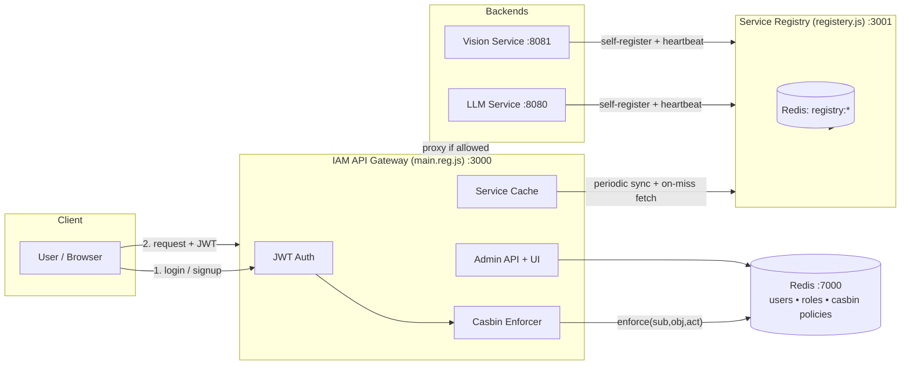
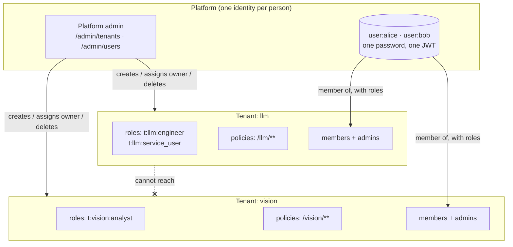

# A Lightweight, Dynamically-Discoverable, Multi-Tenant RBAC Gateway for Heterogeneous Backend Services

**Design, Library Selection, and Implementation of a Redis-Backed Identity and Access Management Layer**

---

## Abstract

Modern backend systems increasingly consist of a small constellation of independently deployable services — an LLM inference service here, a computer-vision service there — each potentially owned by a different team, running on a different host, and reachable at a different address depending on the day. Client applications should not need to know any of that, and they certainly should not be trusted to enforce their own access control. This project implements a single-entry-point **IAM API Gateway** that (1) authenticates users, (2) authorizes their requests against a role-based policy model, and (3) transparently routes allowed requests to whichever backend instance is currently registered as healthy — without the gateway's configuration ever needing to change when a backend moves. Crucially, the gateway is **multi-tenant**: every registered service is a tenant that governs its own roles, its own policies and its own user list, administered by that service's own team rather than by a single platform-wide operator. A person still has one identity, one password and one token across the whole platform; what each tenant controls is not who you are but what you may do there. Isolation between tenants is structural — a tenant's roles exist only under a namespaced Casbin subject and its policies only over its own URL prefix — rather than a rule that must be remembered at each new endpoint. We motivate the problem, survey the design space of authorization models and API gateway patterns, justify each library choice against realistic alternatives, and describe the resulting implementation, its Redis-backed data model, its two-level administrative surface, and its test strategy.

---

## 1. Introduction

### 1.1 Problem Statement

Consider an organization running two internal AI capabilities — a language-model service (`llm`) and a computer-vision service (`vision`) — each exposing several sub-endpoints (`/llm/claude`, `/llm/gemini`, `/vision/service1`, `/vision/facecheck`, …). Three requirements emerge almost immediately:

1. **Identity.** Requests must be traceable to a specific authenticated user, not just "whoever holds a valid API key."
2. **Authorization.** Not every authenticated user should reach every endpoint. A "vision-only" user should not be able to call the LLM service, and vice versa; some users need both.
3. **Location transparency.** Backend services are not static. They restart on different ports during development, move hosts in production, and scale horizontally. Hard-coding `http://10.0.4.12:8080` into a gateway config is a maintenance liability from day one.
4. **Delegated administration.** The LLM team and the vision team are different teams. Routing every "add Bob to our service" through one platform-wide administrator makes that person a bottleneck and, worse, gives whoever holds the role the standing authority to rewrite every other team's access rules. Each service's own team should govern its own access, and no more than that.

A naive solution — each backend service re-implements its own auth check, and clients keep a manually-updated list of service addresses — fails on all three counts: it duplicates security-critical logic N times (each copy a chance to get it wrong), it couples every client to deployment topology, and it makes a uniform audit trail impossible. This motivates a **gateway pattern**: one hardened choke point through which every request must pass, backed by a **service registry** that decouples "what a client asks for" (a logical service name) from "where that service currently lives."

### 1.2 Contribution

This project implements exactly that: a gateway (`src/main.reg.js`) that terminates authentication and RBAC authorization, sitting in front of a self-service **Service Registry** (`src/registery.js`) that backend services register themselves with on boot and are health-checked continuously. On top of that we add a **two-level administrative management plane** — REST endpoints and three small browser UIs — where each registered service is a *tenant* whose own administrators manage its roles, policies and members (§4.1), while a platform operator retains only tenant lifecycle and cross-tenant oversight. Access is inspected and changed live, without redeploying policy files.

---

## 2. Background and Related Work

### 2.1 Access Control Models

Access control research broadly separates into:

- **Discretionary Access Control (DAC)** — resource owners grant access ad hoc (Unix file permissions). Does not scale to "which of 50 users can call which of 12 service endpoints" without becoming an unmanageable matrix.
- **Mandatory Access Control (MAC)** — a central authority assigns fixed security labels (SELinux, Bell–LaPadula). Rigid; overkill for an application-layer gateway.
- **Role-Based Access Control (RBAC)** — users are assigned roles, and permissions are attached to roles rather than to individual users (Sandhu et al., *Role-Based Access Control Models*, IEEE Computer, 1996). This is the standard choice for enterprise systems with recognizable job functions ("blue team can use the LLM service," "red team can also use vision") and is what this system implements: users map to Casbin **`g`** (grouping) relations, and permissions are expressed as **`p`** (policy) rules against roles, not individuals.
- **Attribute-Based Access Control (ABAC)** — permissions are computed from arbitrary attributes of subject/resource/environment (time of day, resource tags, etc.). More expressive than RBAC but harder to reason about and audit. Rejected here as unnecessary complexity: the access questions in this domain ("can this role reach this endpoint with this HTTP verb") are naturally role-shaped, not attribute-shaped.

RBAC was chosen because the problem is *exactly* the textbook RBAC use case — a small number of stable roles (`blue_role`, `red_role`, `green_role`, `admin`) each mapped to a fixed set of resource/action pairs — and because RBAC's role indirection is precisely what lets the admin API add a new role or reassign a user without touching a single policy rule.

### 2.2 The API Gateway Pattern

Routing all external traffic through a single component that owns cross-cutting concerns (authn, authz, rate limiting, request shaping) is a well-established pattern in microservice architectures, popularized by systems like Netflix Zuul, Kong, and Envoy, and formalized in the "API Gateway" pattern description on martinfowler.com / microservices.io. Those systems are production-grade, plugin-based, and heavy. This project deliberately implements a **minimal, purpose-built gateway** rather than adopting one of the above, because the requirement set is narrow (JWT auth + Casbin RBAC + dynamic proxy) and a general-purpose gateway would bring an entire plugin ecosystem, configuration DSL, and operational footprint to bear on a problem that needs perhaps 500 lines of Express. This is a conscious "build vs. buy" trade-off, discussed further in §3.

### 2.3 Service Discovery

Distributed systems typically solve "where is service X right now" with a discovery system: Consul, etcd, ZooKeeper, or a cloud provider's service mesh. All three are strongly-consistent, operationally heavy (often requiring a Raft quorum), and designed for hundreds of nodes. This project's Service Registry (`src/registery.js`) implements the same *idea* — self-registration on boot, periodic health checks, deregistration on shutdown — as a thin layer over Redis, because the operational reality here is a handful of services, not a fleet. See §3.2 for the storage comparison.

### 2.4 Token-Based Authentication

RFC 7519 (JSON Web Token) formalizes a self-contained, signed token as a bearer credential. The alternative — server-side sessions with an opaque session ID looked up in a store — requires a stateful lookup on every request just to know *who* is asking, before authorization even begins. This system uses JWT (`jsonwebtoken`) specifically so that identity verification is a cheap local signature check; the *authorization* decision still legitimately requires a Redis-backed Casbin lookup (§2.1), but *authentication* does not need to.

---

## 3. Design Space and Library Comparison

Every third-party dependency in this project was chosen against at least one realistic alternative. This section makes those comparisons explicit rather than leaving them implicit in `package.json`.

### 3.1 Authorization Engine: Casbin vs. Alternatives

| Option | Verdict | Reasoning |
|---|---|---|
| **Casbin** (chosen) | ✅ | Separates the *access control model* (a small DSL: `request_definition` / `policy_definition` / `matchers`, see `src/main.reg.js`'s `rbacModel`) from the *policy data*. Model changes (e.g., adding ABAC-style conditions later) don't require touching storage or route code. Ships first-class Node.js bindings and a documented adapter interface. |
| Hand-rolled `if (user.role === 'admin')` checks scattered across routes | ❌ | This is what the codebase's own `requireAdmin` middleware still does for the single admin/non-admin distinction — and it is precisely the anti-pattern Casbin exists to avoid at scale. Fine for one boolean gate; unworkable for N roles × M resources × K actions, which is why *all* service-routing decisions go through `enforcer.enforce(...)` instead. |
| Open Policy Agent (OPA) / Rego | ❌ (for this project) | More expressive (general-purpose policy-as-code, used heavily for Kubernetes admission control), but it is a separate process with its own query language, deployment story, and learning curve. Justified when policies are genuinely complex or shared across many heterogeneous systems; here the model is a two-line matcher, and running a sidecar for it would be solving a problem this project doesn't have. |
| AWS Cedar / cloud-native policy services | ❌ | Ties the authorization engine to a specific cloud provider's IAM primitives; this gateway is designed to run anywhere Redis runs. |

### 3.2 Policy & Registry Storage: Redis vs. Alternatives

| Option | Verdict | Reasoning |
|---|---|---|
| **Redis** (chosen) | ✅ | Sub-millisecond reads on the gateway's hot path (every proxied request pays for one `enforcer.enforce` call); native `Hash`/`Set` types map directly onto "one record" (`user:{name}`, `registry:service:{name}`) and "an index of records" (`users:index`, `registry:services`) without an ORM; a single dependency already needed for session-style shared state across gateway replicas. |
| PostgreSQL / relational store | ❌ (for this project) | Would give durability guarantees and ad-hoc querying this project doesn't currently need, at the cost of schema migrations and a heavier connection story, for data that is fundamentally key→hash lookups, not relational joins. Worth revisiting if audit history or complex reporting becomes a requirement (§7). |
| etcd / ZooKeeper (for the registry specifically) | ❌ | Built for strongly-consistent distributed coordination (leader election, watch on config); this registry only needs "list of currently-healthy services," which a `Set` plus a 15-second health-check loop (`runHealthChecks`, `src/registery.js`) already delivers correctly at this scale. |
| In-memory only, no persistence | ❌ | Casbin policies and user records must survive a gateway restart; Redis gives that for free without standing up a full database. |

A deliberate custom component here is the policy store (`src/policy-store.js`) — Casbin ships an official `casbin-redis-adapter` (also a project dependency), but this codebase implements its own thin adapter directly against `ioredis`, storing each policy line as a JSON-encoded list element under one key (`casbin:policies`). This trades some of the official adapter's generality for full visibility into the exact Redis shape (`LRANGE casbin:policies 0 -1` is directly inspectable from `redis-cli`), which matters for a system whose whole purpose is auditability of who-can-access-what.

**One policy, however many gateways.** Each instance enforces from an in-memory copy of that list, and for several instances to behave as one, two things have to hold.

*A change is one step.* The first adapter removed a rule by reading the whole list, filtering it in Node, and writing it back (`DEL`, then an `RPUSH` per row). Between that read and that write another instance could add a rule and have it overwritten, or two could add the same rule and leave two copies — after which removing "the" rule left one behind, still granting. Every change is now a single Lua script, which Redis runs to completion before anything else: add-unless-present, remove-every-copy, remove-by-filter, replace-all. There is no "between".

*Every instance can tell it is behind.* Nothing told the other instances a change had happened; they enforced what they had loaded at boot until they were restarted. The same script that changes the list increments `casbin:policies:version`, so the version moves if, and only if, the policy did. An instance remembers the version of the copy it holds. `authenticate()` already makes one pipelined round trip to Redis per request; the version rides along on it, and if Redis is ahead the instance reloads — reading the list and its version together, in one script, so the two describe the same state — **before** the request goes any further. Being current therefore costs a request nothing unless there is something to catch up on, and a change made through one gateway is in force on every other at its very next request rather than after a polling interval. An instance's own changes do not trigger a reload: if the store went from the version it holds straight to the next, that change is the only thing that happened; any other outcome is treated as "someone else wrote too". A periodic check covers an idle instance and a store that was reset underneath it. `GET /admin/policies` reports the version each instance is enforcing.

### 3.3 Reverse Proxying: `http-proxy-middleware` vs. Alternatives

| Option | Verdict | Reasoning |
|---|---|---|
| **`http-proxy-middleware`** (chosen) | ✅ | Composes as ordinary Express middleware, so the authentication → authorization → proxy pipeline is three lines of middleware chaining (`app.use('/gateway/:serviceName', authenticateJWT, async (req, res, next) => { … return proxy(req, res, next); })`), with the routing target resolved *dynamically per-request* from the service cache rather than statically configured. |
| nginx / Envoy as a sidecar reverse proxy | ❌ (for this project) | Better raw throughput and TLS termination, but authorization would then have to happen out-of-band (e.g., via an `auth_request` subrequest) and the *dynamic* per-request target lookup (§3.4) would require nginx to re-read config or hit a Lua/OpenResty extension — more moving parts than the problem warrants at this scale. |
| Raw `http.request` manual forwarding | ❌ | Reinvents header rewriting, streaming, and error propagation that `http-proxy-middleware` already handles correctly, for no benefit. |

**What a service receives is what the client sent.** A proxy that rewrites the URL is rebuilding a request, and each part has to be carried across on its own terms (`src/proxy-request.js`); an echo service in the test suite reports what actually arrives.

- **Path** — `/{service}` plus the rest of the path exactly as written. It is not decoded and re-encoded: `%2F` inside a segment is one segment, and decoding it addresses a different resource. It is also the string the authorization decision is made on, so what is checked and what is forwarded are the same bytes — which is why the request-target is set on the outgoing request directly rather than left to `http-proxy`, which would re-parse it and collapse `//`. A path containing `.` or `..` segments (plain or as `%2e`) is refused with a 400: it is authorised as one path and resolved by whatever receives it as another, and no reading of it is safe to forward.
- **Query** — the raw text after the first `?`, or nothing. The route used to rebuild the URL from the path alone, so every proxied request silently lost its query string. It is never parsed: a round trip through a query-string parser reorders repeated keys, drops empty ones and changes `+` and `%20`. It plays no part in authorization.
- **Body** — the gateway does not read it. `express.json()` was mounted for every route, so a JSON body sent to `/gateway/...` was consumed before the proxy could pass it on: the service received headers promising a body that never came and waited, and the caller timed out. It also meant the gateway's own 64 kB API limit applied to proxied uploads, and that the gateway answered `400` for JSON it had not been asked to judge. The parser now skips proxied paths (matched case-insensitively, as Express matches the mount), and the stream is piped through — any method, any content type, any size, byte for byte. If a body *has* been consumed before it reaches the proxy, the original bytes (kept by the parser's `verify` hook) are written to the outgoing request, not a re-serialisation of the parsed object, which would change spacing, large numbers and duplicate keys.

### 3.4 Service Discovery Client: Cache-Then-Fallback vs. Alternatives

The gateway does not query the registry on every request. It maintains an **in-memory cache** (`serviceCache`), refreshed on a fixed interval (`SERVICE_SYNC_INTERVAL_MS`) *and* lazily on a cache miss (`getServiceConfig`). This is a deliberate **stale-while-revalidate**-style trade-off: a request never blocks on a full registry round-trip in the common case, at the cost of up to one refresh-interval's staleness if a service's address changes without the gateway having deregistered/re-registered it. Querying the registry synchronously on every proxied request was rejected as adding a full extra network hop to every single call for freshness the failure domain doesn't actually need (services register once at boot and stay put for the process lifetime).

### 3.5 Authentication Token Format: JWT vs. Server-Side Sessions

Already argued in §2.4: JWT (`jsonwebtoken`) lets the gateway establish *which account a request belongs to* from a signature, with no session table. What it must not do is let the token answer anything else. A token is a statement made at login; the account goes on changing afterwards. So the token is kept as small as that one job allows — three claims:

| Claim | Is | Used for |
|---|---|---|
| `sub` | the account's id — a server-generated UUID that never changes and is never reused | the **only** thing an account is looked up by |
| `tokenVersion` | the account's *security version* at the moment of issue | blanket revocation |
| `jti` | this token's own id | revoking this one token (logout) |

There is no username and no role in it. Anything a token asserts about its holder is something a later request might believe instead of checking, which is exactly how a demoted admin kept the admin API for up to 24 hours: the gate read `role` out of the token.

On every request `authenticate()` takes `sub` and asks Redis, now: does this account still exist; is it active; is this token from its current security version; and what is its role. `req.user` is built from those answers, not from the token (two Redis round trips: `EXISTS` on the `jti` denylist pipelined with the id → account lookup, then one `HMGET`).

- **Deleted** — the id → account mapping is gone, so the token matches nothing. Registering the same username again creates a new id; the old token stays dead.
- **Suspended** — `POST /admin/users/:username/suspend` marks the account and moves its security version. It cannot sign in, and every session it had ends with that write.
- **Blanket revocation** — the security version moves whenever the account becomes *less* than it was when its tokens were issued: password changed or reset, suspension, or any access taken away (a platform role, a tenant role, a tenant membership, tenant-admin rights, or the deletion of a role or tenant it held). Authorization is evaluated live, so the access itself stops at once regardless; ending the sessions as well means nothing issued under the old standing survives it.
- **Single-session revocation** — `POST /auth/logout` adds just that token's `jti` to a Redis key with a TTL equal to the token's remaining lifetime, so the denylist never grows unboundedly.

Granting access moves nothing — a token is never *wrong* for holding less than the account now has — which is also what makes the live read observable: an account made an admin can use the admin API with the token it already holds.

### 3.7 Login Rate Limiting: Redis Counters vs. `express-rate-limit`

`express-rate-limit`'s default store is in-process memory, which is the wrong choice for a gateway explicitly designed to scale horizontally (§4): each instance would count independently, so an attacker distributing requests across instances behind a load balancer would see the effective limit multiplied by the instance count. The limits here are Redis counters, shared by every gateway instance:

- **Per-IP** — 200 login attempts a minute from one address (a coarse backstop against spraying across many accounts, not the primary defense).
- **Per-username** — 5 attempts in 15 minutes, which is the actual credential-stuffing/guessing mitigation. It is keyed on the name as typed, whether or not such an account exists, so being locked out says nothing about that.

**The counting is atomic, and it happens first.** The original version read the counter, verified the password, and recorded a failure afterwards — with `INCR` and `EXPIRE` as separate commands. Two things were wrong with that. A crash between the two commands left a counter with no expiry: a lockout that never ends. And any number of requests sent *together* all read a count below the limit before one of them had recorded anything, so "five guesses" was really "as many as fit in one burst". Now each attempt **takes a slot** before the password is looked at, in a single Lua script that increments the counter, sets the window on the first hit and returns the new count (`src/ratelimit.js`). The request is over the limit if the number it was handed exceeds the maximum; there is no gap between deciding and counting for another request to slip through. A successful login gives its slots back, so what accumulates against the limits is still failures — a burst of legitimate logins, or a test suite, does not throttle itself.

**A failed login says one thing.** `401 Invalid username or password`, whether the username exists or not; the distinction is kept for the audit log only. An unknown username still verifies the supplied password against a throwaway Argon2 hash, so the answer the message no longer gives away cannot be read off the response time instead.

**Every authenticated request draws on its account's budget.** Login limits protect a password; they say nothing about what a signed-in account may then do, and nothing did — one account, or one stolen token, could call the API or a proxied service as fast as the network allowed. `authenticate()` now takes one slot per request from a counter keyed by the **account id**, so the budget follows the account across addresses and tokens (signing in again does not refill it) and one account cannot spend another's. There are two budgets, because they are two different things to run out of: `API_REQUESTS_PER_MINUTE` for the gateway's own API and `GATEWAY_REQUESTS_PER_MINUTE` for calls proxied to a service, which is somebody else's capacity being spent. Each defaults to 1200 — a little over twice what the busiest account in the test suites uses; a ceiling on a runaway or hostile client rather than a quota, and a deployment should set its own. The slot is taken only after the token has fully authenticated, so a revoked or forged token cannot exhaust the budget of the account it names; logging out and changing a password are exempt (the latter has its own, tighter limit). Responses carry `RateLimit-Limit` / `-Remaining` / `-Reset`, and over budget is a `429` with `code: "RATE_LIMITED"` and `Retry-After`. Because the take is atomic the budget is exact: 1260 requests sent a hundred at a time against a budget of 1200 get exactly 1200 through.

The same limiter covers the two other places a password can be guessed or work can be forced: `POST /auth/change-password` allows five wrong `currentPassword` attempts per account per 15 minutes (a stolen token must not become an unthrottled password oracle), and `POST /auth/signup` is limited per address (`SIGNUP_MAX_PER_MINUTE`, default 300 — sized so the test suites pass from one address; a public deployment should set it far lower). Limits keyed on the client address need `TRUST_PROXY` set when the gateway sits behind a load balancer, or every client shares the balancer's address.

### 3.6 Password Hashing: bcrypt vs. Alternatives

The system hashes new passwords with **Argon2id** (`argon2.hash`, this library's default parameters), the current OWASP-recommended default for greenfield systems: it is memory-hard, which materially raises the cost of GPU/ASIC-accelerated cracking in a way bcrypt's purely CPU-bound cost factor does not. Accounts created before this change carry legacy `bcrypt` hashes; rather than a forced password-reset migration (impossible without the plaintext anyway), `verifyPassword` detects the hash format by its `$2a$`/`$2b$`/`$2y$` prefix, verifies with `bcrypt.compare`, and — on success — transparently re-hashes the now-known-good password with Argon2 and persists it. The user base migrates itself off bcrypt one successful login at a time, with no dual-write complexity and no disruption to anyone who logs in normally.

---

### 3.8 Service Registration: Trust-on-First-Use Rather Than Liveness-Gated

Registration originally required the registry to fetch `catalogUrl` *successfully* before it would store anything; a failed fetch returned `502 Cannot reach catalogUrl` and nothing was written. The effect was that only a service already running and already serving `/catalog` could be registered — the exact case that doesn't need onboarding — while every genuinely new service got the same 502 no matter what was in the request. Registration was, in practice, write-only for services that were already there.

Two changes fix it, and a third closes what they open up:

1. **`catalogUrl` is optional, and an unreachable one is a warning rather than an error.** The service is registered from the metadata in the request, `health` is recorded separately from `status` (`unchecked` / `unreachable` / `ok`), and the periodic health check records when the service comes up. Separating those two fields is the substance of the fix: `status` answers "should the gateway route here", `health` answers "did the last probe reach it", and collapsing them is what made a not-yet-running service permanently unroutable.
2. **The registered `name` is authoritative.** The old code took `catalog.name || name`, so a service's own `/catalog` could rename the entry — registering three different names against the LLM service's catalog produced three Redis keys that all reported themselves as `llm` and collided in every listing. The key a record lives under and the name it reports must agree; a mismatched catalog now only produces a warning. (A boot-time repair rewrites any record already corrupted this way.)
3. **Names are owned, trust-on-first-use.** Making registration easy makes name hijacking easy, which in a multi-tenant system means capturing another tenant's traffic, headers and bearer tokens. The first registration of a name mints a `serviceToken` (only its SHA-256 is stored) and returns it once. **Every later change to that record needs it**: registering over the name, `PATCH`, `DELETE`, and the heartbeat below. Tenant admins never handle it — the gateway stores it on the tenant record and replays it for `PATCH /tenants/:id/service`, and vouches for a platform admin with a secret the two processes share through Redis.

   An earlier version left one door open: re-registering a name at the *same* `baseUrl` needed no token, so that a restarting service needed no state. But a service's name and baseUrl are both printed by `GET /services`, so that tested nothing. Anyone could re-register `llm` at its own address with a `catalogUrl` of their choosing, and the registry would fetch that URL and adopt the endpoints it advertised; any signed-in user could take over an unowned, self-registered tenant the same way through `POST /tenants/register`. Deregistration was open too.

   **Creating a record needs an authenticated caller too.** The token answers "may this caller change *this* record"; nothing answered "may this caller create one", and `POST /register` for an unused name was open to anyone who could reach the port. Creating a record is not harmless — it puts a route on the gateway, provisions a tenant, and has the registry start probing whatever URL it names. It is now allowed for exactly two callers: **the gateway**, acting for a signed-in user and vouching for them with the secret the two processes share through Redis; and **a service registering itself**, presenting an enrollment token (`X-Enrollment-Token`) that the operator configures on the registry (`REGISTRY_ENROLLMENT_TOKEN`) and gives to the services meant to do that. There is no default token: left unset, direct self-registration is simply off.

   The gateway's vouching is scoped. Anyone signed in may *create* a service; replacing an existing one is for its owner or a platform admin. So when the gateway vouches for a user with no claim on the name, it marks the request `createOnly`, and the registry refuses it if the name exists — in the same step as the write, so there is no gap between "it wasn't there" and "create it" for a record to appear in, and the gateway's override cannot be turned into a way round ownership.

4. **Renewal is not registration.** A service that starts again has nothing new to say about *what* it is — only that it is up. That is now its own call, `POST /services/:name/heartbeat`, which takes the token and no configuration and writes only `health` and `lastSeen`. The same split runs through the registry's own health check: it used to copy `version`, `owner` and `endpoints` out of whatever the catalog URL returned and flip `status` on every pass, so the record was rewritten every fifteen seconds by a process that had authenticated nobody — undoing an admin's edit, re-enabling a service that had been switched off, and racing any `PATCH` that landed mid-probe. A probe now records liveness in one atomic write to those two fields; configuration changes only through an authenticated call (`PATCH`, with `syncFromCatalog: true` to re-read the catalog on request). `src/registry-client.js` is the service side of this: it keeps the token in a file only its owner can read, renews on restart, sends a `PATCH` only if what the process serves differs from what is registered, and deregisters with the token on shutdown.

#### What counts as a duplicate

"Duplicate" covers three genuinely different situations, and collapsing them into one rule gets at least one of them wrong:

| Shape | Decision | Why |
|---|---|---|
| A new name | **Create** — for an authenticated caller only (the gateway, or the enrollment token); otherwise 401 | A record is a route, a tenant and a probe target. |
| Same name, any `baseUrl` | **Refuse** (409) without the `serviceToken` | Registering over a name rewrites its record. Without the token that is name hijacking — and "same `baseUrl`" is no evidence of ownership, since both are public. A restart uses the heartbeat instead. |
| Different name, same `baseUrl` | **Allow**, with a warning naming the other services on that host | One process routinely hosts many logical services — this project's own load-test fleet is 50 services on a single port, and blue/green and path-multiplexed deployments look identical. A blanket refusal would break a legitimate and common topology. |
| Different name, but the catalog reports an **already-registered** service | **Refuse** (409, `duplicateOf`) unless `allowAlias: true` | This is the `llmm`/`llm2` accident, caught precisely. |
| Two tenants, same name | **Impossible** | The tenant id *is* the service name *is* the Redis key, and the index is a Set. There is no code path that creates a second one; `POST /admin/tenants` returns 409. |

The discriminating question for the "same host, different name" case is **identity, not address**. A legitimately co-hosted service is reached at its own catalog path and reports its own name from it (`/catalog/llm-bench-01` → `"name": "llm-bench-01"`); an accidental duplicate is pointed at an existing service's catalog and reports *that* service's name. Rejecting on a shared `baseUrl` would punish the legitimate case and still miss duplicates across two hosts; rejecting on a colliding catalog identity catches exactly the mistake.

5. **A catalog cannot lend its endpoints to another service.** Endpoints must sit under the owning service's `/{name}/` prefix. This was enforced for endpoints supplied in the registration body but *not* for endpoints pulled from a remote `/catalog`, so an alias inherited the original's paths verbatim. Enforcement was never affected — the proxy rewrites the path to `/{name}/…` and Casbin has no rule for it, so such a request is denied — but everything that answers *"who can reach this service"* by matching endpoints (`policiesForService`, and therefore `/admin/services`, `/catalog/services` and the admin access test) reported the **other** service's access under the alias's name. An IAM tool that reports access which does not exist is stating something false about your own security posture, which is its own kind of failure. Foreign endpoints are dropped with a warning wherever a catalog is read — at registration and on a `syncFromCatalog` — and the health check, which used to re-inject them 15 seconds later, no longer reads the catalog's contents at all.

### 3.9 Where the Platform May Connect: an Allowlist on the Resolved Address

A service's `baseUrl` and `catalogUrl` are typed in by whoever registers it, and any signed-in user may register one. The gateway then proxies to that URL and the registry fetches it on a timer. Without a rule about where those connections may go, "register a service" means "have the platform issue requests, from inside its own network, to an address of my choosing" — Redis on localhost, the registry's own unauthenticated port, a cloud metadata endpoint.

The rule (`src/netguard.js`, used by both processes) is an allowlist with no default:

| Setting | Meaning |
|---|---|
| `UPSTREAM_ALLOWED_CIDRS` | Networks a destination may be in. **Required** — with none configured, every destination is refused. |
| `UPSTREAM_ALLOWED_HOSTS` | Optional. If set, the URL's host must also match one of these names (`*.svc.internal` matches subdomains). |
| `UPSTREAM_ALLOWED_PORTS` | Optional. If set, the port must be listed. |

What matters is *what* it is applied to. Checking the text of the URL is not enough, because a hostname is a promise that can change: it can resolve to an allowed address when it is registered and to `169.254.169.254` a minute later (DNS rebinding), or carry one public record and one internal one. So the gateway and registry do the resolution themselves, check **every** address the name resolves to, and open the socket to exactly the address that was checked — connections go through an agent whose `lookup` is the guard, so nothing resolves the name a second time. A literal IP in the URL (including the decimal, hex and IPv4-mapped-IPv6 spellings, which the URL parser and `net.BlockList` normalise) is decided from the URL directly. Redirects are not followed, and a catalog response is capped in size.

It is enforced at three points: when a service is registered or repointed (a clear `400` naming the reason), on every health probe, and on every proxied request — because the record may predate the rule, and the name may have moved since it was checked. Loopback is the right value for the local stack and the wrong one anywhere else: it is where Redis and the registry listen.

**The caller's token stops at the gateway.** The proxy used to forward the request as it arrived, `Authorization` header included. A bearer token here is a credential for the whole platform — every tenant its holder belongs to, and the admin API if they are an admin — so every tenant's backend was being handed a working token for everyone who called it, and a tenant admin controls where that backend lives. The header is now removed, and the service is told who is calling instead: `X-Gateway-User-Id` (the immutable account id) and `X-Gateway-User` (the username, URI-encoded), both set by the gateway on every request so a caller cannot supply their own. A first-party service that genuinely needs the token can be listed by the platform operator in `FORWARD_AUTHORIZATION_TO`; nothing a tenant can do adds a name to that list.

---

### 3.10 Signing In: OpenID Connect, Authorization Code with PKCE

`POST /auth/login` takes a username and password and returns a token. That is the right interface for a script and the wrong one for a person in a browser: it makes every application that wants to sign someone in collect their password itself, so the password is exposed to each application's JavaScript, and "which applications may sign people in" is not a question the IAM is ever asked.

The gateway is therefore also a standard **OpenID Provider** (`src/oidc.js`). It holds the accounts, so it is the party that authenticates; an application — the console included — is a *client* that sends the browser to the gateway and receives proof of who signed in. Nothing here is specific to this project: discovery is at `/.well-known/openid-configuration`, and any OIDC client library can be pointed at it.

| Decision | What was chosen | What was left out, and why |
|---|---|---|
| Flow | **Authorization Code** only | The implicit flow puts tokens in a URL; the password grant is `/auth/login` under another name. Neither is offered: `response_type=token` and `grant_type=password` are refused |
| PKCE | **Required**, `S256` only | Without it a code intercepted on its way back to the application is a token. `plain` is not accepted: it protects nothing if the request is read |
| Clients | **Public** clients, registered by a platform admin with exact redirect URIs (`/admin/oidc/clients`) | Client secrets: a browser or mobile application cannot keep one, and PKCE is what protects the exchange. Redirect URIs match exactly — no prefixes, no wildcards — and must be `https` (or loopback) |
| Sign-in page | Rendered by the gateway, with no script and a `default-src 'none'` policy | A page an application supplies. The form may only post to the gateway and to the client's registered origin, and cannot be framed |
| Code | 256 bits, single use, 60 seconds, stored only as a hash, bound to client, redirect URI and challenge | — |
| ID token | `RS256`, verifiable by anyone from `/oauth/jwks` | Signing ID tokens with the gateway's own `JWT_SECRET` would require giving every client the key that mints sessions. The RSA key is generated once and kept in Redis encrypted under a key derived from `JWT_SECRET`, so every instance signs with the same one |
| Access token | The gateway's ordinary session token | A second token format. What an OIDC sign-in yields is exactly what `/auth/login` yields, subject to the same per-request checks (§3.5) |

The details that matter are the refusals. A request naming an unknown client or an unregistered redirect URI is answered with an error *page* and never a redirect — redirecting is how such a request would be turned into an open redirector. A code presented twice is refused **and the token issued on its first use is revoked**, since two presentations mean two parties hold it. A wrong verifier burns the code. The page's failure message is the same for a wrong password and an unknown account, and it draws on the same counters as `/auth/login` (`checkCredentials()` is the one function both call), so the page is not a way around the lockout. An account holding a temporary password is made to replace it on that page, before any code is issued.

Deliberately not built: refresh tokens (a session lasts as long as its token and ends when the account's security version moves), confidential clients, a consent screen (every client is one a platform admin registered for this organisation), RP-initiated logout (`POST /auth/logout` and `/auth/logout-all` end sessions), and signing-key rotation (one key; replacing it is deleting `oidc:signing-key` and restarting).

---

## 4. System Architecture



**Request lifecycle** for `GET /gateway/llm/claude`:

1. `authenticateJWT` verifies the bearer token's signature and expiry, then looks the account up by the token's `sub` — its immutable id — and checks, against Redis and on every request, that the account still exists, is not suspended, and that the token is from its current security version and not denylisted (§3.5). `req.user` (`{ id, username, role, subject }`) is built from what that lookup returned, not from the token.
2. The route handler resolves the fully-qualified target resource (`/llm/claude`) and asks Casbin about the caller's subject `u:{id}` — the account's server-generated id, never its username — on `('/llm/claude', 'get')`, which evaluates the matcher `g(r.sub, p.sub) && keyMatch(r.obj, p.obj) && r.act == p.act || g(r.sub, "r:platform_admin")` against policy rows Casbin already loaded from Redis at startup (and kept current via `addPolicy`'s auto-save).
3. On `allow`, `getServiceConfig('llm')` resolves the current base URL from the in-memory cache (falling back to a live registry fetch on a cache miss) and the destination guard checks it (§3.9). `http-proxy-middleware` then forwards the request through the guard's agent: the path Express had stripped when matching the mount point is restored, the query string and body are carried across untouched (§3.3), the caller's `Authorization` header is removed, and `X-Gateway-User-Id` / `X-Gateway-User` are set in its place.
4. On `deny`, a `403` is returned before any backend is ever contacted — the backend never sees unauthorized traffic, satisfying the "single hardened choke point" goal from §1.

### 4.1 Multi-Tenancy: Every Registered Service Is a Tenant

The original design had exactly one administrator for the whole platform. That is fine while one team owns every backend, and wrong as soon as two do: the LLM team cannot add a user to their own service without going through someone who has, by construction, the authority to rewrite the Vision team's policies too. The gateway becomes an administrative bottleneck and a blast radius at the same time.

So administration is now split in two, along the line that already exists in the system — the service boundary:

| | Platform admin (`/admin/*`) | Tenant admin (`/tenants/:id/*`) |
|---|---|---|
| Scope | The whole platform | Exactly one tenant |
| Owns | Tenant lifecycle, cross-tenant oversight, platform-wide roles | That tenant's roles, policies, members and request queue |
| Typical action | "Create tenant `payments`, make Alice its owner" | "Give Bob the `engineer` role on `payments`" |
| Can see another tenant's users? | Yes | **No** |



**Identity is global; membership and roles are per tenant.** One person has one account, one password and one JWT, and can be a member of any number of tenants holding a different set of roles in each. The alternative — a separate user table per tenant — would mean an account per service and a tenant claim baked into every token, which defeats the point of a shared gateway. What a tenant owns is not *who you are* but *what you may do here*.

**Isolation is structural, not a matter of checking a flag carefully.** A tenant's roles exist in Casbin only under a namespaced subject:

```
g(u:3f32…, t:llm:engineer)                 alice (by her account id) holds 'engineer' in tenant llm
p(t:llm:engineer, /llm/claude, get)        that role may GET /llm/claude
```

Every tenant write path derives the `t:{id}:` prefix from the URL's `:tenantId` — which the authorization middleware has already checked — rather than from anything in the request body, and `POST /tenants/:id/policies` additionally rejects any `resource` outside `/{id}/`. There is therefore no request shape that lets tenant A name a subject or a resource belonging to tenant B; it is not a rule that has to be remembered at each new endpoint. Two tenants can both define a role called `admin` and the two never meet, because they are `t:llm:admin` and `t:vision:admin`.

The RBAC matcher gains one clause for the platform bypass:

```
m = g(r.sub, p.sub) && keyMatch(r.obj, p.obj) && r.act == p.act
    || g(r.sub, "r:platform_admin")
```

Making the bypass a *role* rather than a hard-coded username means operating the platform no longer requires sharing one account. There is no `r.sub == "admin"` clause: nothing in the system is granted for being *called* something.

**Users, platform roles and tenant roles never share a spelling.** Casbin has one flat subject space and `g(x, x)` is true for every `x`, so wherever a user and a role can be written the same way, the user *is* the role — an account that signed up as `blue_role` held blue_role's policies, and one that signed up as `platform_admin` held the platform. Every subject therefore carries a prefix that the gateway adds and a caller cannot supply:

| Subject | Is | Chosen by |
|---|---|---|
| `u:{uuid}` | an account | the gateway — a random id generated at signup, never the username |
| `r:{name}` | a platform role | a platform admin; `:` is not a legal character in a role name |
| `t:{tenant}:{name}` | a tenant role | that tenant's admins, inside their own prefix |

The API still speaks plain names (`blue_role`, `alice`) and translates at the edge. In a policy, a bare name is always a role; a rule for one specific account has to say so (`user:alice`). On first boot after upgrading, rows written by an older gateway are rewritten once (`casbin:subjects:schema`), resolving any name that was both a user and a role toward the role — the reading that removes access nobody granted.

**Tenant-admin membership lives in Redis, not Casbin** (`tenant:{id}:admins`). It is an API-surface permission ("may call `/tenants/llm/users`"), not a gateway-resource permission, so resolving it is a single `SISMEMBER` rather than a queued call into the serialised enforcer — and it is re-read on every request, so demoting an administrator takes effect immediately instead of whenever their 24-hour token happens to expire.

**Where tenants come from.** Any service in the registry is provisioned as a tenant automatically on the gateway's sync cycle, idempotently — a service that re-registers on every restart never resets the roles and memberships its admins built up. Machine-provisioned tenants start unowned, because a process self-registering over HTTP has no user identity to hand ownership to; a platform admin assigns one with `POST /admin/tenants/:id/owner`. The better path is `POST /tenants/register`, where an authenticated user registers a service and becomes its first administrator in the same call.

**Suspension as a kill switch.** `PATCH /tenants/:id {status:"suspended"}` makes the gateway stop routing to that service immediately, checked before the service lookup. Revoking access by unpicking policies is error-prone under pressure; one flag that fails closed is not.

One consequence of "a registered service *is* a tenant" is worth stating rather than discovering: `DELETE /admin/tenants/:id` without `?deregister=true` is a **reset**, not a deletion. The roles, policies and members go, and then the next sync tick provisions a blank tenant back under the same id, because the service it belongs to is still registered. The response says which of the two happened (`willBeReprovisioned`) instead of letting the tenant reappear a few seconds later looking like a bug.

### 4.2 Why Two Notions of "Role" Coexist

A subtlety worth documenting rather than hiding: each user record (`user:{username}` Redis hash) carries a single flat `role` string *and* Casbin independently tracks a set of `g`-relation roles for that same account's subject (`enforcer.getRolesForUser('u:{id}')`). These are not redundant by accident — they serve different callers:

- The flat field is what `requireAdmin` checks, purely to gate the admin surface itself. It is read from Redis by `authenticate()` on every request — the same `HMGET` that checks the account's status and security version — and is **not** carried in the token, so removing someone's admin role locks them out on their next request, on every gateway instance, rather than when their token expires.
- The Casbin roles are the actual multi-valued RBAC state used for every service-access decision, and a user can legitimately hold several simultaneously (Scenario B in the test suite: `blue_role` *and* `red_role`).

The admin API keeps the two in sync deliberately. `DELETE /admin/roles` collapses the flat field to whatever role (if any) remains, and `admin` takes precedence in both directions: an admin who is granted a second role, or loses an unrelated one, stays an admin. (The field used to be simply "the last role assigned", so handing an admin `blue_role` silently demoted them — harmless while the gate read a 24-hour-old token, not once it reads the field live.)

---

### 4.3 Administering a Tenant Is Four Permissions, Not One

"Tenant admin" used to be a single switch: whoever had it could add members, hand out roles, rewrite policies and repoint the service. Those are different jobs with different risks — the person who onboards colleagues should not thereby be able to change which host the tenant's traffic goes to.

| Permission | Allows | Kept in |
|---|---|---|
| `members` | adding and removing members | `tenant:{id}:perm:members` |
| `roles` | defining roles, granting and revoking them, deciding access requests | `tenant:{id}:perm:roles` |
| `policies` | adding and removing what a role may reach, including conditions (§4.4) | `tenant:{id}:perm:policies` |
| `destinations` | the service's base URL, catalogue and endpoints | `tenant:{id}:perm:destinations` |

A full tenant admin (`tenant:{id}:admins`) holds all four and is the only one who can change who holds what (`PUT /tenants/:id/users/:username/permissions`), promote or demote admins, or edit or suspend the tenant. Each route names the permission it needs, and an action that reaches into two areas needs both: adding a member *with a role* takes `members` and `roles`; approving a request from someone who is not yet a member takes `roles` and `members`; deleting a role that still has policies takes `roles` and `policies`. Removing a tenant admin, or a member's delegated permission, ends that account's sessions like any other downgrade (§3.5). `GET /tenants/:id` reports the caller's own permissions, and the console offers the controls for those and no others — the server is what enforces it.

### 4.4 Attribute Conditions on Policies (ABAC)

Roles answer "may an engineer read `/reports/*`". They cannot say "…for their own department", "…at clearance 2 or above", "…from the office network" or "…in working hours" without a role per combination. Where that is needed, a policy may carry a **condition** (`src/abac.js`), and grants only while it holds:

```json
{ "role": "engineer", "resource": "/reports/*", "action": "get",
  "condition": { "all": [
    { "attr": "subject.department", "op": "eq", "value": { "ref": "resource.department" } },
    { "attr": "subject.clearance",  "op": "gte", "value": 2 },
    { "attr": "request.ip",         "op": "cidr", "value": ["10.0.0.0/8"] } ] } }
```

A condition is data — a small JSON tree of `all` / `any` / `not` and comparisons (`eq ne in nin gt gte lt lte startsWith cidr exists`) — validated when written and interpreted when evaluated; nothing is ever `eval`'d, so writing one cannot make the gateway run anything. It can see `subject.*` (the account's id, username, and attributes set by a **platform** admin with `PUT /admin/users/:username/attributes` — never by the account or a tenant admin, or the rule would be self-service), `resource.*` (service, path, and attributes of the owning tenant), `request.*` (method, ip) and `env.*` (time, hour, weekday, UTC). An attribute that is absent satisfies nothing, including `ne`: "department is not finance" should not be met by an account nobody has described.

It is evaluated inside the Casbin matcher (`conditionHolds(r.ctx, p.sub, p.obj, p.act)`), so a conditional policy is one more row in the same decision rather than a second engine with its own opinion; conditions live beside the rows in `casbin:conditions` and travel with the policy version (§3.2), so every instance enforces the same ones. A policy with no condition behaves exactly as before — a deployment that writes none has plain RBAC, at no cost — and the platform-admin bypass is not subject to conditions. Changing an account's attributes ends its sessions, and the access tests (§5.3) evaluate conditions with the tested account's own attributes.

---

## 5. Implementation

### 5.1 Redis Data Model

| Key pattern | Type | Purpose |
|---|---|---|
| `user:{username}` | Hash | `{id, password (Argon2, or legacy bcrypt until next login), role, status, tokenVersion}`, plus `mustChangePassword` while the account holds a temporary password and `attributes` (JSON) if a platform admin has set any (§4.4). `status` is `active` (or absent) or `suspended`; `tokenVersion` is the account's security version (§3.5). `id` is a server-generated UUID: it is the account's Casbin subject (`u:{id}`) and the `sub` of its tokens |
| `users:index` | Set | Enumerable index of all usernames (backfilled once at boot from any pre-existing `user:*` keys, then maintained on every signup) |
| `users:ids` | Hash | `id → username`, the way back from a Casbin subject to an account for listings |
| `roles:index` | Set | Enumerable index of all *defined* role names, independent of who currently holds them |
| `casbin:policies` | List | One JSON-encoded `{ptype, rule}` element per policy/grouping row — the policy store's format (`src/policy-store.js`). Subjects are always prefixed: `u:{id}`, `r:{role}` or `t:{tenant}:{role}` (§4.1) |
| `casbin:policies:version` | String (integer) | Incremented, in the same script, by every change to `casbin:policies`. How each gateway instance knows whether the copy it enforces from is current (§3.2) |
| `casbin:subjects:schema` | String | Marks the policy list as already rewritten to prefixed subjects, so the one-time migration from bare names never runs twice |
| `iam:bootstrap:initial-admin` | String | Marks the initial administrator as already bootstrapped (Appendix A). Once set, no boot creates or re-grants an admin account |
| `revoked:jti:{jti}` | String | Denylisted token id from an explicit `/auth/logout`; TTL = the token's own remaining lifetime, so entries self-expire |
| `ratelimit:login:ip:{ip}` / `ratelimit:login:user:{username}` / `ratelimit:signup:ip:{ip}` / `ratelimit:password:user:{id}` | String (counter) | Attempt counters backing §3.7's rate limiting; incremented and given their TTL in one atomic script |
| `ratelimit:api:{id}` / `ratelimit:gateway:{id}` | String (counter) | Each account's request budget for the current minute: the gateway's own API, and calls proxied to services (§3.7) |
| `registry:services` | Set | Index of registered service names |
| `registry:service:{name}` | Hash | Service metadata: `baseUrl`, `catalogUrl`, `version`, `owner`, `endpoints` (JSON-encoded array), `status`, `health`, `tokenHash` (SHA-256 of the service token, never returned by the API), timestamps |
| `tenants:index` | Set | Index of all tenant ids |
| `tenant:{id}` | Hash | `{displayName, description, baseUrl, owner, status, source, serviceToken, timestamps}` |
| `tenant:{id}:roles` | Set | Role names defined *inside* this tenant, unqualified (`engineer`, not `t:llm:engineer`) |
| `tenant:{id}:members` | Set | Usernames with standing in this tenant |
| `tenant:{id}:admins` | Set | Subset of members who may administer it — an API-surface permission, resolved per request (§4.1) |
| `tenant:{id}:perm:{permission}` | Set | Members delegated one part of administering it: `members`, `roles`, `policies` or `destinations` (§4.3) |
| `casbin:conditions` | Hash | Attribute conditions (§4.4), keyed by the policy row they belong to; written and removed by the same scripts as the row |
| `recovery:token:{sha256}` / `recovery:account:{id}` | String | A pending password recovery, stored under the hash of its token, and the one such token an account may have; 30-minute TTL (§5.6) |
| `oidc:signing-key` | String | The RSA key ID tokens are signed with, encrypted under a key derived from `JWT_SECRET` (§3.10) |
| `oidc:clients` / `oidc:client:{id}` | Set / String | Registered OIDC applications and their redirect URIs |
| `oidc:code:{hash}` / `oidc:code-used:{hash}` | String | A pending authorization code (60 s), and the marker that lets a second presentation revoke what the first obtained |
| `iam:backup:canary` / `iam:backup:last-success` | String | The id of the backup being taken, so a restored copy can be recognised; and when a backup last left the host (§5.8) |
| `usertenants:{username}` | Set | Reverse index: which tenants a user belongs to |
| `requests:tenant:{id}` | Set | Access requests addressed to this tenant's own queue |

The tenant keys deliberately avoid the `user:{username}:…` shape. The gateway backfills its user index from a `user:*` key scan, so anything hung off that prefix is read back as a username — which is why the reverse index is `usertenants:{username}` and not `user:{username}:tenants`. (The backfill is now type-aware and prunes non-Hash entries as well, so the two defences are independent.)

### 5.2 API Surface

| Area | Endpoints |
|---|---|
| Auth | `POST /auth/signup`, `POST /auth/login`, `POST /auth/change-password` (all rate-limited, §3.7), `POST /auth/logout`, `POST /auth/logout-all`, `POST /auth/password-recovery`, `POST /auth/password-recovery/complete` (§5.6) |
| OpenID Connect | `GET /.well-known/openid-configuration`, `GET /oauth/jwks`, `GET/POST /oauth/authorize`, `POST /oauth/token`, `GET /oauth/userinfo` (§3.10) |
| Admin — Users | `GET /admin/users`, `GET/DELETE /admin/users/:username`, `POST /admin/users/:username/suspend`, `POST /admin/users/:username/reactivate`, `POST /admin/users/:username/revoke-sessions`, `POST /admin/users/:username/recovery-link`, `POST /admin/users/:username/reset-password`, `PUT /admin/users/:username/attributes` |
| Admin — OIDC clients | `GET/POST /admin/oidc/clients`, `DELETE /admin/oidc/clients/:clientId` |
| Admin — Roles | `GET/POST/DELETE /admin/roles`, `POST /admin/roles/define` |
| Admin — Policies | `GET/POST/DELETE /admin/policies` |
| Admin — Services | `GET /admin/services` |
| Admin — Tenants | `GET/POST /admin/tenants`, `DELETE /admin/tenants/:id`, `POST /admin/tenants/:id/owner` |
| Tenant — Onboarding | `POST /tenants/register` (register a service *and* become its admin), `GET /tenants`, `GET /tenants/mine` |
| Tenant — Itself | `GET/PATCH /tenants/:id`, `PATCH /tenants/:id/service` |
| Tenant — Users | `GET/POST /tenants/:id/users`, `DELETE /tenants/:id/users/:username`, `POST /tenants/:id/users/:username/roles`, `DELETE /tenants/:id/users/:username/roles/:role`, `POST/DELETE /tenants/:id/users/:username/admin`, `PUT /tenants/:id/users/:username/permissions` (§4.3), `POST /tenants/:id/users/:username/test-access` |
| Tenant — Roles & Policies | `GET/POST /tenants/:id/roles`, `DELETE /tenants/:id/roles/:role`, `GET/POST/DELETE /tenants/:id/policies` |
| Tenant — Requests | `GET /tenants/:id/requests`, `POST /tenants/:id/requests/:reqId/approve`, `POST /tenants/:id/requests/:reqId/reject` |
| Self-Service | `GET /me`, `POST /me/test-access` (see what your own token actually gets), `GET /catalog/services`, `GET /catalog/roles`, `GET /requests/me`, `POST /requests` (carries an optional `tenant`, routing the request to that tenant's own admins) |
| Gateway | `ALL /gateway/:serviceName/*` (dynamic authz + proxy; refuses a suspended tenant before the service lookup) |
| Registry | `POST /register`, `GET /services`, `GET /services/:name`, `PATCH/DELETE /services/:name` and `POST /services/:name/heartbeat` (service token required, §3.8), `GET /health` |
| Operations | `GET /metrics` (Prometheus text format; scrape token required, §5.7) |
| Docs | `GET /docs`, `GET /docs.json` (Swagger/OpenAPI 3.0.3, `src/swagger.js`) |

Every admin route validates its inputs (non-empty strings for `username`/`role`/`subject`/`resource`/`action`) and distinguishes "malformed request" (400) from "referenced entity doesn't exist" (404) from "exists but you don't have rights" (403) — a distinction that is easy to blur in ad hoc route handlers but matters for a system whose entire job is precise access decisions.

### 5.3 The Console

**One page, one sign-in, three audiences.** The UI began as three pages — an admin panel, a tenant console and a portal — each with its own login form and its own session key. That is three logins for one account, and it made a single product feel like three: a service owner who was also a platform admin signed in twice, and nothing told a new user which URL was theirs. There is now a single console at `/`, and which panels it shows is decided by the server's answer to `GET /me`:

| Account | Views |
|---|---|
| Platform admin | **My access** · **Platform** — tenants & services, accounts, platform roles/policies/requests |
| Service owner (tenant admin) | **My access** · **My services** — register a service, then govern that tenant completely |
| Everyone else | **My access** — what you can reach, and requesting more |

**The console never sees a password.** It is an ordinary OIDC client of the gateway (`iam-console`, §3.10): *Sign in* sends the browser to the gateway's own sign-in page and comes back with a one-time code, which the console exchanges — together with a PKCE verifier that never left the tab — for its session. The password is typed into a page with no script on it. Replacing a temporary password happens on that page too, so the console has no screen for it. Two things are still done from the console's own forms: creating an account, and password recovery (asking for it, and choosing a new password from a recovery link). *My services* appears for anyone who administers any part of a tenant, and each tenant shows only the controls its viewer has been given (§4.3).

It lands on the most privileged thing the account can actually do, so the first screen is the one they came for. The old per-audience URLs (`/admin-ui/admin.html`, `/tenant-ui/`, `/portal/`) all resolve to the same console, so existing links keep working.

The rule lives in one exported function (`entitledViews` in `public/assets/app.js`) rather than inline in the page, so the test suite exercises the real rule against live accounts instead of a copy that could drift from it. It decides what is *rendered* and nothing more: every view's data comes from an endpoint that authorises server-side, so a tampered client gets an empty, 403-ing shell rather than access.

> **A bug worth recording, because the cause is easy to repeat.** The console's panels are toggled with the `hidden` attribute. The browser's own `[hidden] { display: none }` is an element-less rule carrying no `!important`, so *any* author rule that sets `display` outruns it — and `main { display: flex }` in the stylesheet was enough. The entire platform console painted before anyone had signed in. No data was exposed (every request still needed the JWT, and the panels rendered empty), but a console that shows its administrative surface to a logged-out visitor is wrong regardless. The fix is a stylesheet-level `[hidden] { display: none !important }`; `src/ui-check.js` now asserts that rule exists, and that assertion was verified by removing the rule and watching it fail.

**One panel, not two.** The platform view originally had a *Tenants* table and a separate *Registered services* table. They were two views of one object — a registered service **is** a tenant (§4.1) — so the two drifted apart in the reader's head immediately: which one do I edit to change an endpoint, and does creating a row in one create a row in the other? They are now a single expandable list where a row is the service (base URL, catalog, endpoints, health) *and* the tenant (roles, policies, users, requests, owner). The API was reshaped to match rather than the UI papering over it: `POST /admin/tenants` registers the service in the same call and refuses to create a half-made tenant if the registration fails, and `PATCH /tenants/:id/service` is create-or-update so a tenant can be given a service later without the caller having to know which of two endpoints to reach for.

**The tenant panel is one component, mounted twice.** `public/assets/tenant-panel.js` renders and drives everything a tenant contains, and both the Platform view and the My services view mount it. They do the same job on the same object — the only difference is which tenants each may open, which the API already decides. Writing it twice would guarantee the two drift, and *"the admin view can do something the owner's view cannot"* is precisely the drift that becomes a support request.

**The access test is an inspector, not a green tick.** *"Did the role I just granted actually work?"* is the question the whole system exists to answer. When the account under test is your own, the test reports the entire exchange: the bearer token and its decoded claims, the request as it went out (method, URL, headers), and the status, headers and **body** that came back. When it is someone else's, it reports the gateway's decision and what granted or stopped it — see below for why the two differ.

Crucially the outcome is three-valued — `allowed` / `denied` / `error` — not two. The distinction that matters is whether **authorization** refused the call or whether it passed and something further along failed, because those point at opposite ends of the system. Each result carries `stoppedBy` and a plain-language `explanation`:

| `stoppedBy` | Means |
|---|---|
| `gateway-policy` | **denied** — no policy grants it; the request never reached the service |
| `gateway-authentication` | **denied** — token missing, expired or revoked |
| `gateway-tenant-suspended` | **denied** — the tenant is suspended, regardless of policy |
| `upstream` | **denied** — authorization passed; the service itself refused |
| `upstream-missing-endpoint` | **error** — authorization passed and the call *was* proxied, but the service returns 404: the endpoint is advertised in the registry and not implemented |
| `upstream-unreachable` / `upstream-error` | **error** — authorization passed; the service could not be reached, or failed |
| `service-registry` | **error** — the service is not registered or not active |
| `timeout` / `network` | **error** — the request never completed |

> The `error` row exists because collapsing it into `denied` actively misleads. A service that advertised `/whis/persian` in its catalog without implementing it produced a 404 that the report called "denied" — sending the reader to inspect a role and a policy that were both perfectly correct. The cause was a missing route in the service, at the far end of the system from where the label pointed. A tool for answering *"why can't this user reach that?"* has to be right about **where** the answer is.

Three ways in, two mechanisms, split by whose access it is:

- **Your own** (`POST /me/test-access`) is a real call. The gateway replays the caller's own session token through its `/gateway` routes, so a stale or revoked session shows the 401 they would really get, and the service's actual reply is part of the answer. Nobody is being impersonated: it is the request that account would send anyway.
- **Someone else's** — a platform admin (`POST /admin/users/:u/test-access`) or a tenant admin against one of their members (`POST /tenants/:id/users/:u/test-access`) — is evaluated in-process. `decideGatewayAccess()` is the one function that makes the gateway's authorization decision; the proxy route calls it before forwarding a request, and the access test calls the same function about the other account. **No token is issued for that account and nothing is sent to any service.** The result says `allowed` and which policy row (or the bypass role) grants it, or `denied` / `error` and what stopped it. A tenant admin's test covers only their own tenant's `/{id}/…` paths.

An earlier version did the second case the way it does the first: it minted a 60-second token for the target user and replayed it through the proxy, masking the copy it returned. Masking the response was not the exposure. The real token still travelled to every upstream service on the way — including the service operated by the tenant admin who pressed the button — and it was valid for everything that user could do in every tenant, or for the whole platform if the member happened to be a platform admin. *"Test access"* was a way for a tenant admin to obtain another account's credential. The objection that an in-process check "only proves the policy table is self-consistent" is answered by sharing the function rather than re-implementing it: the test cannot report anything the live path would not do, and the suite checks the two against each other endpoint by endpoint. What it gives up is the service's reply, which only the account itself can now fetch.

**Editing a service the gateway never registered.** A service token proves *"I am the process that owns this name"*; the gateway needs something different — authority to act on a name for a human it has already authenticated. Since the gateway and registry already share exactly one trust boundary (Redis), the shared secret lives there, created once with `SETNX` by whichever boots first and never configured or logged. Without it the admin panel could display every self-registered service — which is all of them, before tenancy existed — and change none of them.

The console is framework-free: no bundler, no build step, plain ES modules and one shared stylesheet, reflecting the same "build vs. buy" reasoning as §2.2. The design is dark by construction rather than as a toggle — this is an operations surface people keep open beside a terminal — and colour is spent only on state that carries meaning (allowed, denied, pending, suspended), so a red chip on the page always means something.

### 5.4 Robustness

A centralized error-handling middleware (`app.use((err, req, res, next) => …)`, mounted last in both `main.reg.js` and `registery.js`) catches whatever Express 5 forwards from a rejected async handler and returns a consistent `{error}` JSON body instead of Express's default HTML stack trace — important both for API consumers (who should never have to parse HTML to find out a call failed) and for not leaking internals in a security-facing service. Session revocation (§3.5) and atomic rate limiting (§3.7) round out the hardening: a compromised token can now be killed immediately rather than waiting out its expiry, and repeated bad credentials are throttled per-account and per-IP before they reach password verification.

**Input is validated one way, everywhere.** Each route in both services declares the shape it accepts (`validate({ body, params, query })`, `src/validation.js`), and its handler only ever sees input of that shape: declared fields, trimmed and of the right type and length, with anything undeclared dropped rather than passed along. Before this, every handler checked — or forgot to check — its own input in its own way; lengths were limited nowhere, and a body that was not an object at all reached destructuring and came back as a 500. A violation is a `400` whose `details` name each field; malformed JSON is a `400` and an oversized body a `413`, in the same JSON shape as every other error. The naming rules themselves (what a username, role or tenant id may look like) stay in `tenancy.js`; passwords being set are 8–128 characters, and a policy resource may not contain whitespace, commas or quotes, since policy rows are round-tripped through Casbin's CSV line parser.

### 5.5 Logging

Every process (`main.reg.js`, `registery.js`, `llm.reg.js`, `vision.reg.js`) shares one structured logger (`src/logger.js`): each event is a single JSON line — `{ts, level, service, category, message, ...meta}` — written to both the console and two files under `logs/`: a per-service file (`{service}-{date}.log`) and a combined whole-system file (`combined-{date}.log`) for correlating one request as it crosses the gateway, the registry, and a downstream service. Four levels are used: `info`/`warn`/`error` for operational events, plus a distinct `audit` level for deliberate security-relevant actions — login, logout, signup, password change/reset, every admin mutation (role/policy grant or revoke, user deletion), and every gateway allow/deny decision — so a log consumer can filter "what happened" from "what did someone *do*" without guessing from message text. A `requestLogger()` middleware additionally logs method/path/status/duration/IP/user for every HTTP request. No external logging library (winston/pino) is used: at this project's scale, a ~100-line module already provides everything those libraries would add (structured JSON, file output, levels) without a further dependency to patch or audit.

**Every entry says which request and who.** A request is given an id on arrival (`X-Request-Id`, echoed in the response; a well-formed one supplied by the caller or a front end is kept), and every line written while handling it carries that id, the client address, and — once the caller is authenticated — the account's id and name, without each call site having to pass them along (`AsyncLocalStorage`). An administrative action is therefore attributable from the entry alone, and one request can be followed across everything it caused.

**Security logs leave the host as they are written.** With `LOG_FORWARD_URL` set, entries at the forwarded levels (`audit`, `warn`, `error` by default; `LOG_FORWARD_LEVELS`) are sent to a collector as newline-delimited JSON, in batches, with a bearer token (`src/log-forwarder.js`). Forwarding never blocks a request: entries queue in memory (bounded at 10 000), a failed batch is retried with back-off, and the local files remain the complete record — the queue length, failures and drops are themselves metrics (§5.7). Logs that exist only on the machine being attacked are logs the attacker can edit; a copy elsewhere is also what says what happened *after* the last backup (§5.8). Passwords, tokens and recovery links are never logged, so they are never forwarded; the suite checks the forwarded stream for them.

### 5.6 Account Lifecycle and Password Recovery

An account can be **suspended** and **reactivated** by a platform admin (the account and everything it holds stay; it simply cannot be used, and says so only to someone who has just presented its password), have **every session ended** (`POST /admin/users/:username/revoke-sessions`, or `POST /auth/logout-all` by the account itself), and be **deleted**. Each of these moves the account's security version, so it takes effect on the next request rather than at token expiry (§3.5).

**Recovering a forgotten password** has to work for someone who cannot sign in, which makes it the easiest way into an account if done carelessly. `POST /auth/password-recovery` answers `202` with the same message immediately, whether or not the account exists — the work happens after the response, so neither the body nor the timing says which. For a real, active account it creates a 256-bit single-use token valid for 30 minutes, stores only its SHA-256, and hands a link to the organisation's notification service (`PASSWORD_RECOVERY_WEBHOOK_URL`), which is what knows how to reach a person; the gateway has no mail transport of its own. Without that webhook, a platform admin issues the link instead (`POST /admin/users/:username/recovery-link`) and passes it on out of band — unlike `reset-password`, the admin never learns the account's password. The token travels in the URL *fragment* (`/console#recover=…`), which browsers do not send to servers or put in `Referer`. Completing recovery sets the new password, ends every session, and cancels the token; issuing a new link cancels the old one; requests are limited per address and per account. An admin `reset-password` now sets a *temporary* password, which its holder must replace at next sign-in.

### 5.7 Metrics

`GET /metrics` returns Prometheus text format (`src/metrics.js` — a small in-house registry rather than a client library, for the same reason as the logger). It is off unless `METRICS_TOKEN` is set, and answers only a scraper presenting that token: an admin's session is not accepted, since a monitoring system should not hold an administrator's credential and an administrator's browser should not be able to scrape.

| What | Metrics |
|---|---|
| Error rates | `iam_http_requests_total{area,method,status}`, `iam_http_request_duration_seconds`, `iam_auth_events_total{event}`, `iam_rate_limited_total{bucket}`, `iam_gateway_decisions_total{outcome}`, `iam_proxy_errors_total{reason}` |
| Policy synchronisation | `iam_policy_version` vs `iam_policy_store_version` (an instance that is behind), `iam_policy_sync_latency_seconds` and `iam_policy_last_sync_latency_seconds` (how long a change made on another instance took to be enforced here), `iam_policy_reloads_total`, `iam_policy_reload_duration_seconds` |
| Redis | `iam_redis_up`, `iam_redis_response_seconds`, `iam_redis_connected_clients`, `iam_redis_used_memory_bytes`, `iam_redis_ops_per_second`, `iam_redis_changes_since_last_save`, `iam_redis_last_save_timestamp_seconds`, `iam_redis_last_save_ok`, `iam_redis_aof_enabled` |
| Backups | `iam_backup_last_success_timestamp_seconds` |
| Log forwarding | `iam_log_forward_queue_length`, `…_sent_total`, `…_failed_batches_total`, `…_dropped_total` |

Labels are a fixed vocabulary — an *area* (`auth`, `oauth`, `admin`, `tenants`, `gateway`, …), never a path, username or service name — so nothing a caller sends can create a time series. Worth alerting on: the share of `status="5.."` in `iam_http_requests_total`; `iam_policy_store_version > iam_policy_version` for more than a few seconds; `iam_redis_up == 0`; `time() - iam_backup_last_success_timestamp_seconds` beyond the backup interval; and `iam_log_forward_dropped_total` rising.

### 5.8 Backup and Recovery

Everything the IAM knows is in Redis, and Redis's own `dump.rdb` sits on the same disk, in the clear — protection against a restart and nothing else. `src/backup/redis-backup.js` makes the copy that survives losing the host.

**Taking one.** `npm run backup` streams a point-in-time snapshot out of the running Redis over the replication protocol (`redis-cli --rdb -`: Redis is not paused and its own files are not touched), encrypts it as it arrives — the snapshot is never on the host's disk in the clear — and ships it: to `BACKUP_DIR`, a mounted remote volume, or with `BACKUP_UPLOAD_COMMAND`, any command that copies `$BACKUP_FILE` and `$BACKUP_MANIFEST` somewhere else (`aws s3 cp`, `rclone`, `scp`). A `BACKUP_DIR` on the same disk as Redis's data is refused. Each backup is AES-256-GCM under a fresh key, which is wrapped with RSA-OAEP for the *encryption* key; beside it goes a manifest with the file's SHA-256 and what Redis held, signed with Ed25519.

**Who holds which key** is the design. The IAM host holds the public encryption key and a signing key: it can write backups and cannot read one, so taking the host or the backup store yields no history. The decryption key lives off the host with whoever performs restores — and with it the verification key, because the encryption key being public, anyone who has it can produce a file that decrypts perfectly well; restoring one of those would hand its author every account. A restore therefore checks the signature before it decrypts. `npm run backup:keygen` makes the four files and says which two to move off the host.

**Proving it restores.** A backup nobody has restored is a hope. `npm run backup:drill -- <file>` (or `--latest`), run where the decryption key lives, performs the recovery for real against a throwaway Redis: verifies signature and checksum, decrypts, starts a loopback-only `redis-server` on the result, and checks what came back — that it is *this* backup (a canary written into Redis just before the snapshot), that the account and policy counts match the manifest, that accounts resolve to records with password hashes, and that policy rows parse. It exits non-zero on any failure, touches neither the live Redis nor its files, and deletes its decrypted copy. `npm run backup:selftest` tests the mechanism itself on a Redis it creates: wrong key, wrong passphrase, one flipped byte, truncation, an edited manifest, and a backup forged with the public key are each refused, and a full restore is compared with the original key for key.

**Restoring**, when it is real:

```bash
# on the restore host — the one that holds the decryption and verification keys
node src/backup/redis-backup.js verify  iam-redis-….rdb.enc           # is it ours, and intact?
node src/backup/redis-backup.js drill   iam-redis-….rdb.enc           # does it restore?
node src/backup/redis-backup.js decrypt iam-redis-….rdb.enc --out dump.rdb

# on the IAM host
./start.sh stop                                  # gateways and registry first
redis-cli -p 7000 shutdown nosave                # if Redis is still up: do NOT let it save over the file
mv <redis dir>/dump.rdb <redis dir>/dump.rdb.before-restore      # and appendonlydir/, if AOF was on
cp dump.rdb <redis dir>/dump.rdb && rm dump.rdb
redis-server --port 7000 --appendonly no …       # load the RDB (with AOF on, Redis prefers an AOF, old or empty, to the RDB)
redis-cli -p 7000 config set appendonly yes      # then turn AOF back on, if you use it
JWT_SECRET=<a NEW secret> ./start.sh             # see below
```

A restore turns the clock back: an account suspended, a role revoked or a password changed *after* the backup is active, granted and unchanged again, and a session ended since then is valid again. So start the gateway with a **new `JWT_SECRET`**, which ends every session issued before the restore (the OIDC signing key is regenerated with it, and clients fetch the new one from `/oauth/jwks`), and re-apply what happened since the backup from the forwarded audit log (§5.5) — which is why that log must not live only on this host.

**Schedule and persistence.** Run `npm run backup` from cron or a systemd timer at the interval you can afford to lose (hourly is a reasonable start: `0 * * * * cd /opt/iam && npm run --silent backup`), and the drill on the restore host at least monthly; alert on `iam_backup_last_success_timestamp_seconds` going stale. Between backups, what protects against a crash is Redis's own persistence: run it with `appendonly yes` and `appendfsync everysec` so a crash loses at most a second, rather than whatever accumulated since the last RDB save (`iam_redis_changes_since_last_save`).

---

## 6. Evaluation and Testing

The system is tested black-box, over HTTP, against fully live services (Redis + Registry + LLM + Vision + Gateway all running) rather than through mocked units. This is a deliberate methodology choice: the highest-risk surface in an IAM gateway is the *integration* between Casbin's enforcement, Redis's persistence, JWT verification, and dynamic proxying — exactly the seams that unit tests with mocked collaborators tend to paper over. Three test artifacts reflect this, at increasing levels of formality:

- **`test/vision.test.sh`** — a bash/curl smoke test of the Vision mock service in isolation.
- **`test/main.test.js`** — a `node:test`-based integration script exercising the core login → grant-role → access-granted flow against a live gateway.
- **`src/e2e.test.js`** — the primary suite, across preflight/service-discovery, registry CRUD, authentication (including tampered/expired/malformed-token cases), full admin CRUD for users/roles/policies (validation, 404s, non-admin blocks), three full RBAC scenarios (LLM-only vs. LLM+Vision access vs. a role defined-granted-policy-attached-revoked live), a 16-step full user lifecycle (signup through deletion, verifying access changes at every step), session security (logout revocation, password change/reset invalidating outstanding tokens, account lockout under repeated failures), privilege-escalation guards, service registration (§3.8), multi-tenancy (§4.1), and OpenAPI spec completeness — all against fully live services, run twice consecutively to confirm the suite is idempotent against its own accumulating test data, not just passing once by luck.
- **`src/ui-check.js`** — the console is hand-written ES modules driving live DOM, where a handful of failure modes account for nearly all breakage and none show up in a syntax check: a script reaching for an element id the markup never defines (panel dead on load), a script reading a response field the API does not return (panel blank), a `hidden` element that renders anyway (see §5.3), a button carrying two pieces of data under names a handler can confuse (a "remove role" button that sent the username as the role, so the server correctly answered *"alice does not have role alice"*), and the wrong account being shown the wrong view. The render helpers are pure string functions, so the exact markup they emit is asserted directly rather than inferred from a click. So ids are cross-referenced statically between markup and script, every path the UI calls is checked against the gateway's route table, the pre-auth concealment rule is asserted in the stylesheet, every field path the UI depends on is asserted against a live response, and the real `entitledViews` function is exercised against three live accounts — admin, service owner, plain member. Arrays are checked element by element, not sampled at index 0, since a field present on the first row and missing on the rest is a real rendering bug.
- **`src/endpoint-check.js`** — a coverage check rather than a test suite. It does not work from a hand-maintained list of endpoints, because that is exactly the list that goes stale and lets a broken route sit unnoticed. Instead it parses the route table straight out of `main.reg.js` and `registery.js` (every `app.get(...)`, `app.post(...)`, …), probes each route with a realistically authorised request, and **fails on any route it parsed but has no probe for**. Adding an endpoint without adding a probe is itself a reported failure, so the number below cannot quietly drift.

The multi-tenancy suite is deliberately weighted towards negative assertions, because in a tenanted system the interesting claim is not "an admin can do X" but "an admin of tenant A *cannot* do X to tenant B": it stands up a real backing service, has an ordinary non-admin user register it, and then checks that its owner can govern it completely while being refused — with distinct, correct status codes — a role definition in another tenant, a policy naming another tenant's path, a read of another tenant's user list, every `/admin/*` surface, and a self-granted platform role. Tenant deletion is checked for Casbin residue specifically: a leftover `g(alice, t:gone:admin)` row would silently re-grant access if the name were ever reused.

Sign-in, operations and recovery are tested the same way. The OpenID Connect suite walks the code flow as a client would — verifying the ID token against the published key rather than trusting it — and then every refusal in §3.10: a wrong verifier, a replayed code (and that the first token dies with it), missing or `plain` PKCE, an unregistered or extended redirect URI, a tampered form, a suspended account, and a lockout shared with `/auth/login`. Metrics, log forwarding and recovery delivery are switched on by configuration, so the suite starts a second gateway with them configured and a small collector to receive what it sends: it checks that a policy change made through one gateway shows up as measured sync latency on the other, that forwarded entries carry the request id and the acting account, and that no password, token or recovery link appears anywhere in the forwarded stream. The backup tool has its own self-test (§5.8), against a Redis it creates.

Current state: **327/327 e2e tests pass**, the endpoint check reports **93/93 probes passing with all 91 defined routes covered**, the UI contract check reports **0 failures**, and the backup self-test passes **17/17**. The console's behaviour in a real browser — in particular the redirect to the sign-in page and back — is covered only by these API and static checks, not by a browser-driven test.

---

## 7. Limitations and Future Work

Documenting a system honestly means naming what it does *not* solve:

1. **Single Redis instance is a single point of failure** for both authorization data and service discovery. A production deployment would need Redis Sentinel/Cluster; the current `retryStrategy` backoff only smooths over transient blips, not a genuine outage.
2. ~~No cross-instance cache invalidation.~~ **Resolved (§3.2):** every policy change is an atomic script that also moves a version counter, and each instance checks that version on every authenticated request and reloads before proceeding if it is behind. The residual cost is that catching up is a full reload of the policy list rather than an incremental one — proportional to the size of the policy, paid once per instance per batch of changes made elsewhere; a single instance never reloads for its own changes.
3. ~~JWTs cannot be revoked before expiry.~~ **Resolved (§3.5):** `tokenVersion` + a `jti` denylist now support both blanket revocation (password change/reset) and single-session revocation (`/auth/logout`). The residual cost is one extra `HGET`/`EXISTS` per authenticated request, and a token issued *before* this change (no `tokenVersion` claim) is treated as version 0. Tokens are now also bound to the account's id (`sub`, §4.1): one that predates that claim, or that names an account which has since been deleted, is rejected and its holder signs in again.
4. ~~Logs are durable but not centralized.~~ **Resolved (§5.5):** security-relevant entries are forwarded to a collector as they are written, each carrying the request id and the acting account. What remains: the local files under `logs/` still have no rotation or retention policy, and forwarding is at-least-once from a bounded in-memory queue — entries queued when the process dies, or arriving while the queue is full during a long collector outage, exist only in the local files.
5. ~~bcrypt over Argon2.~~ **Resolved (§3.6):** new passwords hash with Argon2id; existing bcrypt hashes migrate lazily on next successful login.
6. ~~No rate limiting on `/auth/login`.~~ **Resolved (§3.7):** Redis-backed per-IP and per-username attempt counters, taken atomically before the password is checked. The per-username lockout is a double-edged sword worth naming explicitly: because it triggers on failures alone, an attacker who *doesn't care about breaking in* can weaponize it as a targeted denial-of-service — deliberately failing a specific victim's login 5 times locks that victim out for 15 minutes. A production system would likely pair this with CAPTCHA-after-N-failures or IP-scoped (rather than global) lockout to close that gap.
7. **No audit log beyond the operational log files.** §5.5's `audit`-level log entries record every admin/auth action, but they live in the same flat files as everything else rather than a queryable, tamper-evident store — worth a durable, append-only table (§3.2's PostgreSQL alternative becomes attractive specifically for this) if "who changed what, when" ever needs to survive a `logs/` directory being rotated away or needs to resist after-the-fact tampering.

8. ~~Tenant administration is coarse-grained.~~ **Resolved (§4.3):** managing members, allocating roles, altering policies and changing destinations are separate permissions. There is still no per-tenant audit view separate from the global log.
9. **Nothing stops a tenant from declaring endpoints it does not serve.** Endpoint declarations are validated for namespace (`/{id}/…`) but not for liveness, so a tenant can advertise `/payments/refund` and return 502 for it. Honest, but it means the catalogue promises reachability it has not verified; the health check verifies the service, not each endpoint.
10. **Service-name ownership is trust-on-first-use.** §3.8's token protects a name *after* first registration, and creating one now takes an authenticated caller — but among those callers, whoever registers a name first owns it, and there is no approval step before a name is claimed. For a closed deployment that is the right trade; an open one would want the platform admin to approve a tenant before its name is bound.

11. **The OIDC provider is deliberately minimal (§3.10).** Public clients with PKCE only: no refresh tokens, no confidential clients, no consent screen, no RP-initiated logout, one signing key with no rotation schedule. An application that needs any of those needs them built.
12. **Password recovery is only as good as its delivery.** The gateway hands the link to a webhook and has no mail transport of its own; with no webhook configured, self-service recovery is recorded and answered but nothing is sent, and a platform admin issues the link instead. There is no second factor anywhere in the system, so whoever controls the delivery channel controls the account.
13. **Backups are periodic snapshots (§5.8).** What is lost with the host is everything since the last one; there is no point-in-time recovery, and a restore reverts suspensions and revocations made since, which have to be re-applied from the forwarded log. The backup tool refuses a destination on Redis's own disk but cannot know that a mount point is really another machine.
14. **Attribute conditions see only what the gateway knows (§4.4):** attributes set on accounts and tenants, and the request's method, path and address. They cannot depend on the *content* of the resource a service holds — "the author of this document" is a decision only the service can make.

None of these invalidate the core design; they scope where it currently sits on the simplicity/robustness curve, and where the next investment should go if requirements grow.

---

## 8. Conclusion

This project demonstrates that a small, purpose-built RBAC gateway — a few hundred lines of Express, one authorization library chosen for its model/storage separation, and Redis as the sole stateful dependency — can correctly solve the "authenticate, authorize by role, and route to a dynamically-located backend" problem without adopting the operational weight of a general-purpose API gateway or a distributed coordination service. Every dependency was selected against a named alternative rather than by default, and the resulting system is small enough that its entire policy and routing behavior is auditable directly from `redis-cli`.

---

## Appendix A: Running the System

Start components in dependency order (each backend self-registers with the registry on boot; the gateway fetches from the registry, so it must start last):

```bash
export JWT_SECRET="$(openssl rand -base64 48)"        # required — see below
export UPSTREAM_ALLOWED_CIDRS="127.0.0.0/8,::1/128"   # required — where services may live (§3.9)
export REGISTRY_ENROLLMENT_TOKEN="$(openssl rand -hex 32)"   # for the registry AND the self-registering services (§3.8)
redis-server --port 7000          # or point REDIS_URL elsewhere
node src/registery.js             # Service Registry      :3001
node src/llm.reg.js               # LLM mock service       :8080 (self-registers)
node src/vision.reg.js            # Vision mock service    :8081 (self-registers)
node src/main.reg.js              # IAM Gateway            :3000
```

`./start.sh` does all of the above in order, waits for each component to answer, and reports what came up; `./start.sh stop|restart|status|logs` manage it afterwards.

**The signing key has no default.** The gateway reads `JWT_SECRET` from the environment and exits at startup — before opening a port or a Redis connection — if it is missing, shorter than 32 bytes, or a repeated-character filler. A built-in fallback is a key published in the repository, and anyone who has read it can mint a platform-admin token for every deployment that forgot to override it. `start.sh` reads an untracked `.env` (see `.env.example`); every gateway instance behind one load balancer must share the same key, and changing it signs everyone out.

**The first administrator is created once.** The first time the gateway boots against an empty Redis it creates `admin` with a random password, writes that password to `.run/initial-admin-password` (mode `0600`, or wherever `INITIAL_ADMIN_PASSWORD_FILE` points — never to the logs), and records in Redis that the bootstrap has happened. That password signs in to exactly one thing: replacing it — on the sign-in page, which asks for a new one before letting the console in, or with `POST /auth/change-password` from a script. Every other route answers `403 PASSWORD_CHANGE_REQUIRED` until it has been replaced, at which point the file is deleted. The bootstrap never runs again — not if the account is deleted, and not if someone later registers the name — so further platform admins are made by an existing one (`POST /admin/roles` with `admin` and `platform_admin`). A deployment upgraded from a version that seeded `admin`/`adminpass` has that password replaced the same way on its first boot, because every copy of the old README gives it away.

**Where services may live has no default either.** `UPSTREAM_ALLOWED_CIDRS` (§3.9) is read by both the registry and the gateway, and with nothing in it they refuse every destination; `start.sh` stops and says so rather than bringing up a stack in which nothing can register. For this local stack the mock services run on the same machine, so the value is loopback — which is exactly the value not to use anywhere else. `.env.example` lists the optional settings: `UPSTREAM_ALLOWED_HOSTS` / `_PORTS`, `FORWARD_AUTHORIZATION_TO`, `TRUST_PROXY`, `SIGNUP_MAX_PER_MINUTE`, `API_REQUESTS_PER_MINUTE`, `GATEWAY_REQUESTS_PER_MINUTE`, and the operational ones described below.

**Tell the gateway its own address.** `PUBLIC_URL` is the URL people reach the gateway at (default `http://localhost:$PORT`). It is the OIDC issuer, the address in every recovery link, and the only place the console's sign-in may return to — so behind a proxy or under a real hostname it must be set, to an `https://` URL, and the console must be opened under that name. Signing in from the console needs a secure context (HTTPS, or `localhost`).

**Operational settings, all off until set:** `METRICS_TOKEN` enables `GET /metrics` for a scraper presenting it (§5.7); `LOG_FORWARD_URL` (with `LOG_FORWARD_TOKEN`, `LOG_FORWARD_LEVELS`) forwards security logs to a collector (§5.5); `PASSWORD_RECOVERY_WEBHOOK_URL` (with `PASSWORD_RECOVERY_WEBHOOK_TOKEN`) is the notification service recovery links are handed to (§5.6); the `BACKUP_*` settings configure backups (§5.8).

**Self-registration needs a credential.** The registry creates a record only for a caller it can authenticate (§3.8). `llm.reg.js` and `vision.reg.js` register themselves, so they — and the registry — are given `REGISTRY_ENROLLMENT_TOKEN`; `start.sh` requires it for that reason. A deployment whose services are all registered through the gateway can leave it unset, which switches direct registration off.

`start.sh` reads these from an untracked `.env` and reports everything that is missing in one go. The programs you run by hand — the test suites, the load-test tools, a mock service started on its own — read the same `.env` (`src/local-env.js`), so they find the enrollment token, and `ADMIN_PASSWORD` if you keep it there, without a line of exports. The gateway and the registry do not: where a long-running service gets its secrets is the deployment's decision.

**Self-registering services keep a token.** The first time `llm.reg.js` or `vision.reg.js` registers, the registry issues the token that owns that name and the service stores it under `.run/service-tokens/` (mode `0600`). On later starts it renews with a heartbeat; on shutdown it deregisters with the token. If a record for the name already exists and the process holds no token for it — left by a version that did not keep one, or registered by someone else — the service says so and leaves the record alone (the gateway goes on routing to wherever that record points). Whoever operates the registry can remove such a record, using the secret the registry and gateway share through Redis, after which the service registers afresh on its next start and the tenant of the same name carries on with its roles and members intact:

```bash
curl -X DELETE http://localhost:3001/services/llm \
  -H "X-Registry-Admin-Token: $(redis-cli -p 7000 get registry:admin-token)"
```

(A platform admin can also do it from the console or with `DELETE /admin/tenants/:id?deregister=true`, but that removes the tenant's roles, policies and members along with the registration.)

The test scripts need a platform admin to run as and have no built-in one: `ADMIN_PASSWORD=… npm run e2e` (likewise `check:endpoints`, `check:ui` and the load test), or `ADMIN_PASSWORD` in `.env`. The load test is, by design, thousands of signups and admin calls from one address and one account in a few seconds — what the limits in §3.7 exist to stop — so start the gateway for it with them raised: `SIGNUP_MAX_PER_MINUTE=1000000 API_REQUESTS_PER_MINUTE=1000000 GATEWAY_REQUESTS_PER_MINUTE=1000000 ./start.sh restart`.

Structured logs land in `logs/` (§5.5) — `tail -f logs/combined-$(date +%F).log` for a whole-system view, or `logs/gateway-*.log` / `logs/registry-*.log` / etc. per-service.

| | |
|---|---|
| Console (everyone — panels follow your account) | `http://localhost:3000/` |
| Interactive API docs | `http://localhost:3000/docs` |

```bash
npm run e2e                       # full black-box test suite  (327 tests)
npm run check                     # route coverage + UI contract checks
npm run backup:selftest           # backup, tamper detection and restore, on a throwaway Redis

npm run backup:keygen             # once: makes the keys, and says which two to move off the host
npm run backup                    # snapshot → encrypt → sign → ship   (schedule this)
npm run backup:drill -- --latest  # on the restore host: prove the newest backup restores
```

### Onboarding a service, end to end

The shortest path from "I have a service" to "my users can call it", with no platform admin involved after the first line:

```bash
# 1. Any user signs up, then registers their service. The service does NOT have
#    to be running — an unreachable catalogUrl is a warning, not a failure.
curl -X POST localhost:3000/auth/signup -H 'content-type: application/json' \
  -d '{"username":"alice","password":"s3cret-pass"}'
TOKEN=$(curl -sX POST localhost:3000/auth/login -H 'content-type: application/json' \
  -d '{"username":"alice","password":"s3cret-pass"}' | jq -r .token)

curl -X POST localhost:3000/tenants/register -H "authorization: Bearer $TOKEN" \
  -H 'content-type: application/json' \
  -d '{"name":"payments","baseUrl":"http://localhost:9090",
       "catalogUrl":"http://localhost:9090/catalog","displayName":"Payments API"}'
# -> 201; alice is now the administrator of tenant 'payments'

# 2. Alice defines a role and what it may reach — inside her tenant only.
curl -X POST localhost:3000/tenants/payments/roles -H "authorization: Bearer $TOKEN" \
  -H 'content-type: application/json' -d '{"role":"engineer"}'
curl -X POST localhost:3000/tenants/payments/policies -H "authorization: Bearer $TOKEN" \
  -H 'content-type: application/json' \
  -d '{"role":"engineer","resource":"/payments/charge","action":"get"}'

# 3. Alice grants it to an existing account. Identity is platform-wide; the role is hers to give.
curl -X POST localhost:3000/tenants/payments/users -H "authorization: Bearer $TOKEN" \
  -H 'content-type: application/json' -d '{"username":"bob","role":"engineer"}'

# 4. Bob can now reach it — and nothing else.
curl localhost:3000/gateway/payments/charge -H "authorization: Bearer $BOB_TOKEN"   # 200
curl localhost:3000/gateway/llm/claude      -H "authorization: Bearer $BOB_TOKEN"   # 403
```

Or do the same thing in the browser at `/tenant-ui/`.

## References

- Sandhu, R., Coyne, E., Feinstein, H., Youman, C. — *Role-Based Access Control Models*, IEEE Computer, 1996.
- Jones, M., Bradley, J., Sakimura, N. — *JSON Web Token (JWT)*, RFC 7519, IETF, 2015.
- Casbin Authorization Library — https://casbin.org
- Fowler, M. / microservices.io — *API Gateway* pattern.
- OWASP — *Password Storage Cheat Sheet* (bcrypt/Argon2 comparison).
- Biryukov, A., Dinu, D., Khovratovich, D. — *Argon2: New Generation of Memory-Hard Functions*, IEEE EuroS&P, 2016.
- `http-proxy-middleware` — https://github.com/chimurai/http-proxy-middleware
