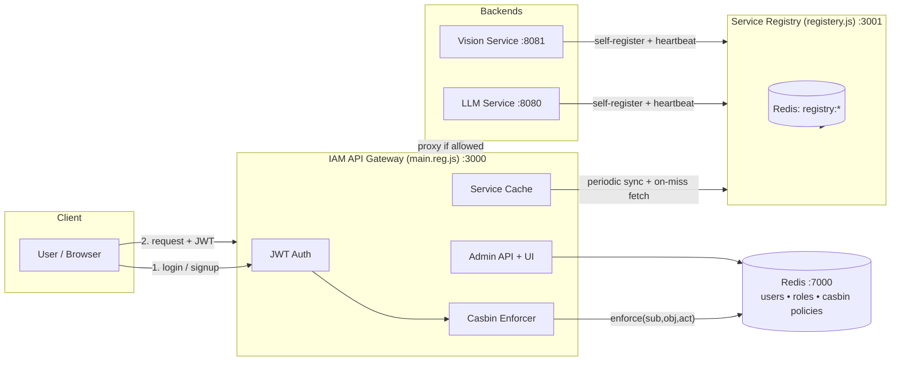
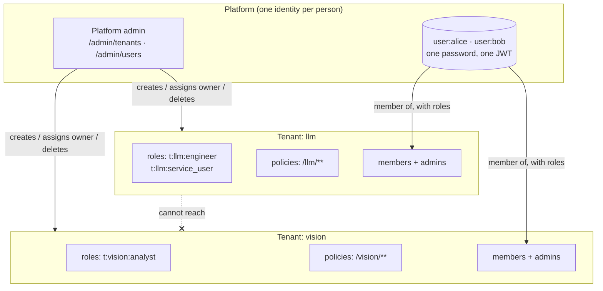

# A Lightweight, Dynamically-Discoverable, Multi-Tenant RBAC Gateway for Heterogeneous Backend Services

**Design, Library Selection, and Implementation of a Redis-Backed Identity and Access Management Layer**

---

## Abstract

Modern backend systems increasingly consist of a small constellation of independently deployable services — an LLM inference service here, a computer-vision service there — each potentially owned by a different team, running on a different host, and reachable at a different address depending on the day. Client applications should not need to know any of that, and they certainly should not be trusted to enforce their own access control. This project implements a single-entry-point **IAM API Gateway** that (1) authenticates users, (2) authorizes their requests against a role-based policy model, and (3) transparently routes allowed requests to whichever backend instance is currently registered as healthy — without the gateway's configuration ever needing to change when a backend moves. Crucially, the gateway is **multi-tenant**: every registered service is a tenant that governs its own roles, its own policies and its own user list, administered by that service's own team rather than by a single platform-wide operator. A person still has one identity, one password and one token across the whole platform; what each tenant controls is not who you are but what you may do there. Isolation between tenants is structural — a tenant's roles exist only under a namespaced Casbin subject and its policies only over its own URL prefix — rather than a rule that must be remembered at each new endpoint. We motivate the problem, survey the design space of authorization models and API gateway patterns, justify each library choice against realistic alternatives, and describe the resulting implementation, its Redis-backed data model, its two-level administrative surface, and its test strategy.

---

## 1. Introduction

### 1.1 Problem Statement

Consider an organization running two internal AI capabilities — a language-model service (`llm`) and a computer-vision service (`vision`) — each exposing several sub-endpoints (`/llm/claude`, `/llm/gemini`, `/vision/service1`, `/vision/facecheck`, …). Three requirements emerge almost immediately:

1. **Identity.** Requests must be traceable to a specific authenticated user, not just "whoever holds a valid API key."
2. **Authorization.** Not every authenticated user should reach every endpoint. A "vision-only" user should not be able to call the LLM service, and vice versa; some users need both.
3. **Location transparency.** Backend services are not static. They restart on different ports during development, move hosts in production, and scale horizontally. Hard-coding `http://10.0.4.12:8080` into a gateway config is a maintenance liability from day one.
4. **Delegated administration.** The LLM team and the vision team are different teams. Routing every "add Bob to our service" through one platform-wide administrator makes that person a bottleneck and, worse, gives whoever holds the role the standing authority to rewrite every other team's access rules. Each service's own team should govern its own access, and no more than that.

A naive solution — each backend service re-implements its own auth check, and clients keep a manually-updated list of service addresses — fails on all three counts: it duplicates security-critical logic N times (each copy a chance to get it wrong), it couples every client to deployment topology, and it makes a uniform audit trail impossible. This motivates a **gateway pattern**: one hardened choke point through which every request must pass, backed by a **service registry** that decouples "what a client asks for" (a logical service name) from "where that service currently lives."

### 1.2 Contribution

This project implements exactly that: a gateway (`src/main.reg.js`) that terminates authentication and RBAC authorization, sitting in front of a self-service **Service Registry** (`src/registery.js`) that backend services register themselves with on boot and are health-checked continuously. On top of that we add a **two-level administrative management plane** — REST endpoints and three small browser UIs — where each registered service is a *tenant* whose own administrators manage its roles, policies and members (§4.1), while a platform operator retains only tenant lifecycle and cross-tenant oversight. Access is inspected and changed live, without redeploying policy files.

---

## 2. Background and Related Work

### 2.1 Access Control Models

Access control research broadly separates into:

- **Discretionary Access Control (DAC)** — resource owners grant access ad hoc (Unix file permissions). Does not scale to "which of 50 users can call which of 12 service endpoints" without becoming an unmanageable matrix.
- **Mandatory Access Control (MAC)** — a central authority assigns fixed security labels (SELinux, Bell–LaPadula). Rigid; overkill for an application-layer gateway.
- **Role-Based Access Control (RBAC)** — users are assigned roles, and permissions are attached to roles rather than to individual users (Sandhu et al., *Role-Based Access Control Models*, IEEE Computer, 1996). This is the standard choice for enterprise systems with recognizable job functions ("blue team can use the LLM service," "red team can also use vision") and is what this system implements: users map to Casbin **`g`** (grouping) relations, and permissions are expressed as **`p`** (policy) rules against roles, not individuals.
- **Attribute-Based Access Control (ABAC)** — permissions are computed from arbitrary attributes of subject/resource/environment (time of day, resource tags, etc.). More expressive than RBAC but harder to reason about and audit. Rejected here as unnecessary complexity: the access questions in this domain ("can this role reach this endpoint with this HTTP verb") are naturally role-shaped, not attribute-shaped.

RBAC was chosen because the problem is *exactly* the textbook RBAC use case — a small number of stable roles (`blue_role`, `red_role`, `green_role`, `admin`) each mapped to a fixed set of resource/action pairs — and because RBAC's role indirection is precisely what lets the admin API add a new role or reassign a user without touching a single policy rule.

### 2.2 The API Gateway Pattern

Routing all external traffic through a single component that owns cross-cutting concerns (authn, authz, rate limiting, request shaping) is a well-established pattern in microservice architectures, popularized by systems like Netflix Zuul, Kong, and Envoy, and formalized in the "API Gateway" pattern description on martinfowler.com / microservices.io. Those systems are production-grade, plugin-based, and heavy. This project deliberately implements a **minimal, purpose-built gateway** rather than adopting one of the above, because the requirement set is narrow (JWT auth + Casbin RBAC + dynamic proxy) and a general-purpose gateway would bring an entire plugin ecosystem, configuration DSL, and operational footprint to bear on a problem that needs perhaps 500 lines of Express. This is a conscious "build vs. buy" trade-off, discussed further in §3.

### 2.3 Service Discovery

Distributed systems typically solve "where is service X right now" with a discovery system: Consul, etcd, ZooKeeper, or a cloud provider's service mesh. All three are strongly-consistent, operationally heavy (often requiring a Raft quorum), and designed for hundreds of nodes. This project's Service Registry (`src/registery.js`) implements the same *idea* — self-registration on boot, periodic health checks, deregistration on shutdown — as a thin layer over Redis, because the operational reality here is a handful of services, not a fleet. See §3.2 for the storage comparison.

### 2.4 Token-Based Authentication

RFC 7519 (JSON Web Token) formalizes a self-contained, signed token as a bearer credential. The alternative — server-side sessions with an opaque session ID looked up in a store — requires a stateful lookup on every request just to know *who* is asking, before authorization even begins. This system uses JWT (`jsonwebtoken`) specifically so that identity verification is a cheap local signature check; the *authorization* decision still legitimately requires a Redis-backed Casbin lookup (§2.1), but *authentication* does not need to.

---

## 3. Design Space and Library Comparison

Every third-party dependency in this project was chosen against at least one realistic alternative. This section makes those comparisons explicit rather than leaving them implicit in `package.json`.

### 3.1 Authorization Engine: Casbin vs. Alternatives

| Option | Verdict | Reasoning |
|---|---|---|
| **Casbin** (chosen) | ✅ | Separates the *access control model* (a small DSL: `request_definition` / `policy_definition` / `matchers`, see `src/main.reg.js`'s `rbacModel`) from the *policy data*. Model changes (e.g., adding ABAC-style conditions later) don't require touching storage or route code. Ships first-class Node.js bindings and a documented adapter interface. |
| Hand-rolled `if (user.role === 'admin')` checks scattered across routes | ❌ | This is what the codebase's own `requireAdmin` middleware still does for the single admin/non-admin distinction — and it is precisely the anti-pattern Casbin exists to avoid at scale. Fine for one boolean gate; unworkable for N roles × M resources × K actions, which is why *all* service-routing decisions go through `enforcer.enforce(...)` instead. |
| Open Policy Agent (OPA) / Rego | ❌ (for this project) | More expressive (general-purpose policy-as-code, used heavily for Kubernetes admission control), but it is a separate process with its own query language, deployment story, and learning curve. Justified when policies are genuinely complex or shared across many heterogeneous systems; here the model is a two-line matcher, and running a sidecar for it would be solving a problem this project doesn't have. |
| AWS Cedar / cloud-native policy services | ❌ | Ties the authorization engine to a specific cloud provider's IAM primitives; this gateway is designed to run anywhere Redis runs. |

### 3.2 Policy & Registry Storage: Redis vs. Alternatives

| Option | Verdict | Reasoning |
|---|---|---|
| **Redis** (chosen) | ✅ | Sub-millisecond reads on the gateway's hot path (every proxied request pays for one `enforcer.enforce` call); native `Hash`/`Set` types map directly onto "one record" (`user:{name}`, `registry:service:{name}`) and "an index of records" (`users:index`, `registry:services`) without an ORM; a single dependency already needed for session-style shared state across gateway replicas. |
| PostgreSQL / relational store | ❌ (for this project) | Would give durability guarantees and ad-hoc querying this project doesn't currently need, at the cost of schema migrations and a heavier connection story, for data that is fundamentally key→hash lookups, not relational joins. Worth revisiting if audit history or complex reporting becomes a requirement (§7). |
| etcd / ZooKeeper (for the registry specifically) | ❌ | Built for strongly-consistent distributed coordination (leader election, watch on config); this registry only needs "list of currently-healthy services," which a `Set` plus a 15-second health-check loop (`runHealthChecks`, `src/registery.js`) already delivers correctly at this scale. |
| In-memory only, no persistence | ❌ | Casbin policies and user records must survive a gateway restart; Redis gives that for free without standing up a full database. |

A deliberate custom component here is `CasbinRedisAdapter` (`src/main.reg.js`) — Casbin ships an official `casbin-redis-adapter` (also a project dependency), but this codebase implements its own thin adapter directly against `ioredis`, storing each policy line as a JSON-encoded list element under one key (`casbin:policies`). This trades some of the official adapter's generality for full visibility into the exact Redis shape (`LRANGE casbin:policies 0 -1` is directly inspectable from `redis-cli`), which matters for a system whose whole purpose is auditability of who-can-access-what.

### 3.3 Reverse Proxying: `http-proxy-middleware` vs. Alternatives

| Option | Verdict | Reasoning |
|---|---|---|
| **`http-proxy-middleware`** (chosen) | ✅ | Composes as ordinary Express middleware, so the authentication → authorization → proxy pipeline is three lines of middleware chaining (`app.use('/gateway/:serviceName', authenticateJWT, async (req, res, next) => { … return proxy(req, res, next); })`), with the routing target resolved *dynamically per-request* from the service cache rather than statically configured. |
| nginx / Envoy as a sidecar reverse proxy | ❌ (for this project) | Better raw throughput and TLS termination, but authorization would then have to happen out-of-band (e.g., via an `auth_request` subrequest) and the *dynamic* per-request target lookup (§3.4) would require nginx to re-read config or hit a Lua/OpenResty extension — more moving parts than the problem warrants at this scale. |
| Raw `http.request` manual forwarding | ❌ | Reinvents header rewriting, streaming, and error propagation that `http-proxy-middleware` already handles correctly, for no benefit. |

### 3.4 Service Discovery Client: Cache-Then-Fallback vs. Alternatives

The gateway does not query the registry on every request. It maintains an **in-memory cache** (`serviceCache`), refreshed on a fixed interval (`SERVICE_SYNC_INTERVAL_MS`) *and* lazily on a cache miss (`getServiceConfig`). This is a deliberate **stale-while-revalidate**-style trade-off: a request never blocks on a full registry round-trip in the common case, at the cost of up to one refresh-interval's staleness if a service's address changes without the gateway having deregistered/re-registered it. Querying the registry synchronously on every proxied request was rejected as adding a full extra network hop to every single call for freshness the failure domain doesn't actually need (services register once at boot and stay put for the process lifetime).

### 3.5 Authentication Token Format: JWT vs. Server-Side Sessions

Already argued in §2.4: JWT (`jsonwebtoken`) avoids a stateful session lookup purely to answer "who is this," while leaving the (necessarily stateful, Redis-backed) authorization question to Casbin where it belongs. The classical objection to JWTs is that a token cannot be revoked before its 24-hour expiry — this no longer fully applies here. Every token carries a `tokenVersion` claim (copied from the account's current counter at login) and a unique `jti`. `authenticateJWT` performs one cheap `HGET` per request to compare `tokenVersion` against the live value in Redis, plus an `EXISTS` check against a `revoked:jti:*` denylist:

- **Blanket revocation** — `POST /auth/change-password` and the admin `POST /admin/users/:username/reset-password` both increment the account's `tokenVersion`, instantly invalidating *every* outstanding token for that user in one write, without needing to know which tokens exist.
- **Single-session revocation** — `POST /auth/logout` adds just that token's `jti` to a Redis key with a TTL equal to the token's remaining lifetime, so the denylist never grows unboundedly (an entry disappears exactly when the token it blocks would have expired anyway).

This keeps the core JWT trade-off (no session lookup needed to answer "is this signature valid") while closing the one gap that actually mattered in practice: a credential reset now takes effect immediately, not up to 24 hours later. The remaining cost is the extra `HGET`/`EXISTS` per authenticated request — deliberately paid, since it is far cheaper than the full session-table lookup a server-side-session design would require for *every* field, not just revocation status.

### 3.7 Login Rate Limiting: Redis Counters vs. `express-rate-limit`

`express-rate-limit`'s default store is in-process memory, which is the wrong choice for a gateway explicitly designed to scale horizontally (§4): each instance would count independently, so an attacker distributing requests across instances behind a load balancer would see the effective limit multiplied by the instance count. `/auth/login` instead uses two small Redis `INCR`/`EXPIRE` counters, shared by every gateway instance:

- **Per-IP** — flags an address responsible for an anomalous volume of *failed* logins (200/minute; this is a coarse backstop against spraying across many accounts, not the primary defense).
- **Per-username** — locks a specific account out for 15 minutes after 5 failed attempts, which is the actual credential-stuffing/guessing mitigation.

Both counters count **failures only**, deliberately — a burst of successful logins (a legitimate traffic spike, or a test suite) never contributes to either limit; only wrong-password/unknown-user responses do. This is a meaningful design choice, not an oversight: a limiter keyed on total request volume would eventually throttle legitimate use under normal load, while one keyed on failures targets the actual abuse signal.

### 3.6 Password Hashing: bcrypt vs. Alternatives

The system hashes new passwords with **Argon2id** (`argon2.hash`, this library's default parameters), the current OWASP-recommended default for greenfield systems: it is memory-hard, which materially raises the cost of GPU/ASIC-accelerated cracking in a way bcrypt's purely CPU-bound cost factor does not. Accounts created before this change carry legacy `bcrypt` hashes; rather than a forced password-reset migration (impossible without the plaintext anyway), `verifyPassword` detects the hash format by its `$2a$`/`$2b$`/`$2y$` prefix, verifies with `bcrypt.compare`, and — on success — transparently re-hashes the now-known-good password with Argon2 and persists it. The user base migrates itself off bcrypt one successful login at a time, with no dual-write complexity and no disruption to anyone who logs in normally.

---

### 3.8 Service Registration: Trust-on-First-Use Rather Than Liveness-Gated

Registration originally required the registry to fetch `catalogUrl` *successfully* before it would store anything; a failed fetch returned `502 Cannot reach catalogUrl` and nothing was written. The effect was that only a service already running and already serving `/catalog` could be registered — the exact case that doesn't need onboarding — while every genuinely new service got the same 502 no matter what was in the request. Registration was, in practice, write-only for services that were already there.

Two changes fix it, and a third closes what they open up:

1. **`catalogUrl` is optional, and an unreachable one is a warning rather than an error.** The service is registered from the metadata in the request, `health` is recorded separately from `status` (`unchecked` / `unreachable` / `ok`), and the periodic health check fills in live metadata when the service comes up. Separating those two fields is the substance of the fix: `status` answers "should the gateway route here", `health` answers "did the last probe reach it", and collapsing them is what made a not-yet-running service permanently unroutable.
2. **The registered `name` is authoritative.** The old code took `catalog.name || name`, so a service's own `/catalog` could rename the entry — registering three different names against the LLM service's catalog produced three Redis keys that all reported themselves as `llm` and collided in every listing. The key a record lives under and the name it reports must agree; a mismatched catalog now only produces a warning. (A boot-time repair rewrites any record already corrupted this way.)
3. **Names are owned, trust-on-first-use.** Making registration easy makes name hijacking easy, which in a multi-tenant system means capturing another tenant's traffic, headers and bearer tokens. The first registration of a name mints a `serviceToken` (only its SHA-256 is stored) and returns it once. Re-registering the same name at the same `baseUrl` stays open, so a service that self-registers on every restart needs no state of its own; repointing a name at a *different* host requires the token. Tenant admins never handle it — the gateway stores it on the tenant record and replays it for `PATCH /tenants/:id/service`.

#### What counts as a duplicate

"Duplicate" covers three genuinely different situations, and collapsing them into one rule gets at least one of them wrong:

| Shape | Decision | Why |
|---|---|---|
| Same name, same `baseUrl` | **Allow** — idempotent refresh | A service re-registering on restart. Refusing it would force every service to carry registration state. |
| Same name, different `baseUrl` | **Refuse** (409) without the `serviceToken` | This is name hijacking: whoever holds the name receives the traffic, headers and bearer tokens addressed to it. |
| Different name, same `baseUrl` | **Allow**, with a warning naming the other services on that host | One process routinely hosts many logical services — this project's own load-test fleet is 50 services on a single port, and blue/green and path-multiplexed deployments look identical. A blanket refusal would break a legitimate and common topology. |
| Different name, but the catalog reports an **already-registered** service | **Refuse** (409, `duplicateOf`) unless `allowAlias: true` | This is the `llmm`/`llm2` accident, caught precisely. |
| Two tenants, same name | **Impossible** | The tenant id *is* the service name *is* the Redis key, and the index is a Set. There is no code path that creates a second one; `POST /admin/tenants` returns 409. |

The discriminating question for the "same host, different name" case is **identity, not address**. A legitimately co-hosted service is reached at its own catalog path and reports its own name from it (`/catalog/llm-bench-01` → `"name": "llm-bench-01"`); an accidental duplicate is pointed at an existing service's catalog and reports *that* service's name. Rejecting on a shared `baseUrl` would punish the legitimate case and still miss duplicates across two hosts; rejecting on a colliding catalog identity catches exactly the mistake.

4. **A catalog cannot lend its endpoints to another service.** Endpoints must sit under the owning service's `/{name}/` prefix. This was enforced for endpoints supplied in the registration body but *not* for endpoints pulled from a remote `/catalog`, so an alias inherited the original's paths verbatim. Enforcement was never affected — the proxy rewrites the path to `/{name}/…` and Casbin has no rule for it, so such a request is denied — but everything that answers *"who can reach this service"* by matching endpoints (`policiesForService`, and therefore `/admin/services`, `/catalog/services` and the admin access test) reported the **other** service's access under the alias's name. An IAM tool that reports access which does not exist is stating something false about your own security posture, which is its own kind of failure. Foreign endpoints are now dropped with a warning at registration *and* on every health check — sanitising only at registration would let the next probe re-inject them 15 seconds later.

---

## 4. System Architecture



**Request lifecycle** for `GET /gateway/llm/claude`:

1. `authenticateJWT` verifies the bearer token's signature and expiry, then checks the token against Redis for revocation (`tokenVersion` match + `jti` not denylisted, §3.5) before populating `req.user` (`{ username, role, tokenVersion, jti }`).
2. The route handler resolves the fully-qualified target resource (`/llm/claude`) and asks `enforcer.enforce(username, '/llm/claude', 'get')`, which evaluates the matcher `g(r.sub, p.sub) && keyMatch(r.obj, p.obj) && r.act == p.act || r.sub == "admin"` against policy rows Casbin already loaded from Redis at startup (and kept current via `addPolicy`'s auto-save).
3. On `allow`, `getServiceConfig('llm')` resolves the current base URL from the in-memory cache (falling back to a live registry fetch on a cache miss), and `http-proxy-middleware` forwards the request, rewriting `req.url` back to the full path Express had stripped when matching the mount point.
4. On `deny`, a `403` is returned before any backend is ever contacted — the backend never sees unauthorized traffic, satisfying the "single hardened choke point" goal from §1.

### 4.1 Multi-Tenancy: Every Registered Service Is a Tenant

The original design had exactly one administrator for the whole platform. That is fine while one team owns every backend, and wrong as soon as two do: the LLM team cannot add a user to their own service without going through someone who has, by construction, the authority to rewrite the Vision team's policies too. The gateway becomes an administrative bottleneck and a blast radius at the same time.

So administration is now split in two, along the line that already exists in the system — the service boundary:

| | Platform admin (`/admin/*`) | Tenant admin (`/tenants/:id/*`) |
|---|---|---|
| Scope | The whole platform | Exactly one tenant |
| Owns | Tenant lifecycle, cross-tenant oversight, platform-wide roles | That tenant's roles, policies, members and request queue |
| Typical action | "Create tenant `payments`, make Alice its owner" | "Give Bob the `engineer` role on `payments`" |
| Can see another tenant's users? | Yes | **No** |



**Identity is global; membership and roles are per tenant.** One person has one account, one password and one JWT, and can be a member of any number of tenants holding a different set of roles in each. The alternative — a separate user table per tenant — would mean an account per service and a tenant claim baked into every token, which defeats the point of a shared gateway. What a tenant owns is not *who you are* but *what you may do here*.

**Isolation is structural, not a matter of checking a flag carefully.** A tenant's roles exist in Casbin only under a namespaced subject:

```
g(alice, t:llm:engineer)                   alice holds 'engineer' in tenant llm
p(t:llm:engineer, /llm/claude, get)        that role may GET /llm/claude
```

Every tenant write path derives the `t:{id}:` prefix from the URL's `:tenantId` — which the authorization middleware has already checked — rather than from anything in the request body, and `POST /tenants/:id/policies` additionally rejects any `resource` outside `/{id}/`. There is therefore no request shape that lets tenant A name a subject or a resource belonging to tenant B; it is not a rule that has to be remembered at each new endpoint. Two tenants can both define a role called `admin` and the two never meet, because they are `t:llm:admin` and `t:vision:admin`.

The RBAC matcher gains one clause for the platform bypass:

```
m = g(r.sub, p.sub) && keyMatch(r.obj, p.obj) && r.act == p.act
    || r.sub == "admin" || g(r.sub, "platform_admin")
```

Making the bypass a *role* rather than a hard-coded username means operating the platform no longer requires sharing one account. The literal `r.sub == "admin"` clause is kept so that policies and tokens written before this change keep working.

**Tenant-admin membership lives in Redis, not Casbin** (`tenant:{id}:admins`). It is an API-surface permission ("may call `/tenants/llm/users`"), not a gateway-resource permission, so resolving it is a single `SISMEMBER` rather than a queued call into the serialised enforcer — and it is re-read on every request, so demoting an administrator takes effect immediately instead of whenever their 24-hour token happens to expire.

**Where tenants come from.** Any service in the registry is provisioned as a tenant automatically on the gateway's sync cycle, idempotently — a service that re-registers on every restart never resets the roles and memberships its admins built up. Machine-provisioned tenants start unowned, because a process self-registering over HTTP has no user identity to hand ownership to; a platform admin assigns one with `POST /admin/tenants/:id/owner`. The better path is `POST /tenants/register`, where an authenticated user registers a service and becomes its first administrator in the same call.

**Suspension as a kill switch.** `PATCH /tenants/:id {status:"suspended"}` makes the gateway stop routing to that service immediately, checked before the service lookup. Revoking access by unpicking policies is error-prone under pressure; one flag that fails closed is not.

One consequence of "a registered service *is* a tenant" is worth stating rather than discovering: `DELETE /admin/tenants/:id` without `?deregister=true` is a **reset**, not a deletion. The roles, policies and members go, and then the next sync tick provisions a blank tenant back under the same id, because the service it belongs to is still registered. The response says which of the two happened (`willBeReprovisioned`) instead of letting the tenant reappear a few seconds later looking like a bug.

### 4.2 Why Two Notions of "Role" Coexist

A subtlety worth documenting rather than hiding: each user record (`user:{username}` Redis hash) carries a single flat `role` string *and* Casbin independently tracks a set of `g`-relation roles for that same user (`enforcer.getRolesForUser`). These are not redundant by accident — they serve different callers:

- The flat field is embedded in the **JWT payload** at login and is what `requireAdmin` checks, cheaply, with no Redis access, purely to gate the admin surface itself.
- The Casbin roles are the actual multi-valued RBAC state used for every service-access decision, and a user can legitimately hold several simultaneously (Scenario B in the test suite: `blue_role` *and* `red_role`).

The admin API's `DELETE /admin/roles` keeps the two in sync deliberately: removing a Casbin role also collapses the flat field to whatever role (if any) remains, so the JWT-embedded field never drifts into naming a role the user no longer actually has.

---

## 5. Implementation

### 5.1 Redis Data Model

| Key pattern | Type | Purpose |
|---|---|---|
| `user:{username}` | Hash | `{password (Argon2, or legacy bcrypt until next login), role, tokenVersion}` |
| `users:index` | Set | Enumerable index of all usernames (backfilled once at boot from any pre-existing `user:*` keys, then maintained on every signup) |
| `roles:index` | Set | Enumerable index of all *defined* role names, independent of who currently holds them |
| `casbin:policies` | List | One JSON-encoded `{ptype, rule}` element per policy/grouping row — the custom `CasbinRedisAdapter`'s storage format |
| `revoked:jti:{jti}` | String | Denylisted token id from an explicit `/auth/logout`; TTL = the token's own remaining lifetime, so entries self-expire |
| `ratelimit:login:ip:{ip}` / `ratelimit:login:user:{username}` | String (counter) | Failed-login counters backing §3.7's rate limiting; TTL-bounded fixed windows |
| `registry:services` | Set | Index of registered service names |
| `registry:service:{name}` | Hash | Service metadata: `baseUrl`, `catalogUrl`, `version`, `owner`, `endpoints` (JSON-encoded array), `status`, `health`, `tokenHash` (SHA-256 of the service token, never returned by the API), timestamps |
| `tenants:index` | Set | Index of all tenant ids |
| `tenant:{id}` | Hash | `{displayName, description, baseUrl, owner, status, source, serviceToken, timestamps}` |
| `tenant:{id}:roles` | Set | Role names defined *inside* this tenant, unqualified (`engineer`, not `t:llm:engineer`) |
| `tenant:{id}:members` | Set | Usernames with standing in this tenant |
| `tenant:{id}:admins` | Set | Subset of members who may administer it — an API-surface permission, resolved per request (§4.1) |
| `usertenants:{username}` | Set | Reverse index: which tenants a user belongs to |
| `requests:tenant:{id}` | Set | Access requests addressed to this tenant's own queue |

The tenant keys deliberately avoid the `user:{username}:…` shape. The gateway backfills its user index from a `user:*` key scan, so anything hung off that prefix is read back as a username — which is why the reverse index is `usertenants:{username}` and not `user:{username}:tenants`. (The backfill is now type-aware and prunes non-Hash entries as well, so the two defences are independent.)

### 5.2 API Surface

| Area | Endpoints |
|---|---|
| Auth | `POST /auth/signup`, `POST /auth/login` (rate-limited, §3.7), `POST /auth/logout`, `POST /auth/change-password` |
| Admin — Users | `GET /admin/users`, `GET/DELETE /admin/users/:username`, `POST /admin/users/:username/reset-password` |
| Admin — Roles | `GET/POST/DELETE /admin/roles`, `POST /admin/roles/define` |
| Admin — Policies | `GET/POST/DELETE /admin/policies` |
| Admin — Services | `GET /admin/services` |
| Admin — Tenants | `GET/POST /admin/tenants`, `DELETE /admin/tenants/:id`, `POST /admin/tenants/:id/owner` |
| Tenant — Onboarding | `POST /tenants/register` (register a service *and* become its admin), `GET /tenants`, `GET /tenants/mine` |
| Tenant — Itself | `GET/PATCH /tenants/:id`, `PATCH /tenants/:id/service` |
| Tenant — Users | `GET/POST /tenants/:id/users`, `DELETE /tenants/:id/users/:username`, `POST /tenants/:id/users/:username/roles`, `DELETE /tenants/:id/users/:username/roles/:role`, `POST/DELETE /tenants/:id/users/:username/admin`, `POST /tenants/:id/users/:username/test-access` |
| Tenant — Roles & Policies | `GET/POST /tenants/:id/roles`, `DELETE /tenants/:id/roles/:role`, `GET/POST/DELETE /tenants/:id/policies` |
| Tenant — Requests | `GET /tenants/:id/requests`, `POST /tenants/:id/requests/:reqId/approve`, `POST /tenants/:id/requests/:reqId/reject` |
| Self-Service | `GET /me`, `POST /me/test-access` (see what your own token actually gets), `GET /catalog/services`, `GET /catalog/roles`, `GET /requests/me`, `POST /requests` (carries an optional `tenant`, routing the request to that tenant's own admins) |
| Gateway | `ALL /gateway/:serviceName/*` (dynamic authz + proxy; refuses a suspended tenant before the service lookup) |
| Registry | `POST /register`, `GET /services`, `GET/PATCH/DELETE /services/:name`, `GET /health` |
| Docs | `GET /docs`, `GET /docs.json` (Swagger/OpenAPI 3.0.3, `src/swagger.js`) |

Every admin route validates its inputs (non-empty strings for `username`/`role`/`subject`/`resource`/`action`) and distinguishes "malformed request" (400) from "referenced entity doesn't exist" (404) from "exists but you don't have rights" (403) — a distinction that is easy to blur in ad hoc route handlers but matters for a system whose entire job is precise access decisions.

### 5.3 The Console

**One page, one sign-in, three audiences.** The UI began as three pages — an admin panel, a tenant console and a portal — each with its own login form and its own session key. That is three logins for one account, and it made a single product feel like three: a service owner who was also a platform admin signed in twice, and nothing told a new user which URL was theirs. There is now a single console at `/`, and which panels it shows is decided by the server's answer to `GET /me`:

| Account | Views |
|---|---|
| Platform admin | **My access** · **Platform** — tenants & services, accounts, platform roles/policies/requests |
| Service owner (tenant admin) | **My access** · **My services** — register a service, then govern that tenant completely |
| Everyone else | **My access** — what you can reach, and requesting more |

It lands on the most privileged thing the account can actually do, so the first screen is the one they came for. The old per-audience URLs (`/admin-ui/admin.html`, `/tenant-ui/`, `/portal/`) all resolve to the same console, so existing links keep working.

The rule lives in one exported function (`entitledViews` in `public/assets/app.js`) rather than inline in the page, so the test suite exercises the real rule against live accounts instead of a copy that could drift from it. It decides what is *rendered* and nothing more: every view's data comes from an endpoint that authorises server-side, so a tampered client gets an empty, 403-ing shell rather than access.

> **A bug worth recording, because the cause is easy to repeat.** The console's panels are toggled with the `hidden` attribute. The browser's own `[hidden] { display: none }` is an element-less rule carrying no `!important`, so *any* author rule that sets `display` outruns it — and `main { display: flex }` in the stylesheet was enough. The entire platform console painted before anyone had signed in. No data was exposed (every request still needed the JWT, and the panels rendered empty), but a console that shows its administrative surface to a logged-out visitor is wrong regardless. The fix is a stylesheet-level `[hidden] { display: none !important }`; `src/ui-check.js` now asserts that rule exists, and that assertion was verified by removing the rule and watching it fail.

**One panel, not two.** The platform view originally had a *Tenants* table and a separate *Registered services* table. They were two views of one object — a registered service **is** a tenant (§4.1) — so the two drifted apart in the reader's head immediately: which one do I edit to change an endpoint, and does creating a row in one create a row in the other? They are now a single expandable list where a row is the service (base URL, catalog, endpoints, health) *and* the tenant (roles, policies, users, requests, owner). The API was reshaped to match rather than the UI papering over it: `POST /admin/tenants` registers the service in the same call and refuses to create a half-made tenant if the registration fails, and `PATCH /tenants/:id/service` is create-or-update so a tenant can be given a service later without the caller having to know which of two endpoints to reach for.

**The tenant panel is one component, mounted twice.** `public/assets/tenant-panel.js` renders and drives everything a tenant contains, and both the Platform view and the My services view mount it. They do the same job on the same object — the only difference is which tenants each may open, which the API already decides. Writing it twice would guarantee the two drift, and *"the admin view can do something the owner's view cannot"* is precisely the drift that becomes a support request.

**The access test is an inspector, not a green tick.** *"Did the role I just granted actually work?"* is the question the whole system exists to answer, so the test reports the entire exchange: the bearer token and its decoded claims, the request as it went out (method, URL, headers), and the status, headers and **body** that came back.

Crucially the outcome is three-valued — `allowed` / `denied` / `error` — not two. The distinction that matters is whether **authorization** refused the call or whether it passed and something further along failed, because those point at opposite ends of the system. Each result carries `stoppedBy` and a plain-language `explanation`:

| `stoppedBy` | Means |
|---|---|
| `gateway-policy` | **denied** — no policy grants it; the request never reached the service |
| `gateway-authentication` | **denied** — token missing, expired or revoked |
| `gateway-tenant-suspended` | **denied** — the tenant is suspended, regardless of policy |
| `upstream` | **denied** — authorization passed; the service itself refused |
| `upstream-missing-endpoint` | **error** — authorization passed and the call *was* proxied, but the service returns 404: the endpoint is advertised in the registry and not implemented |
| `upstream-unreachable` / `upstream-error` | **error** — authorization passed; the service could not be reached, or failed |
| `service-registry` | **error** — the service is not registered or not active |
| `timeout` / `network` | **error** — the request never completed |

> The `error` row exists because collapsing it into `denied` actively misleads. A service that advertised `/whis/persian` in its catalog without implementing it produced a 404 that the report called "denied" — sending the reader to inspect a role and a policy that were both perfectly correct. The cause was a missing route in the service, at the far end of the system from where the label pointed. A tool for answering *"why can't this user reach that?"* has to be right about **where** the answer is.

Three ways in, one probe: a platform admin (`POST /admin/users/:u/test-access`), a tenant admin against one of their members (`POST /tenants/:id/users/:u/test-access`), and — new — the person whose access it actually is (`POST /me/test-access`). The self-test replays the caller's **own** session token rather than minting one, so a stale or revoked session shows the 401 they would really get instead of a freshly-signed success.

Showing the token is the point — a denial cannot be debugged without seeing what the gateway read — but it forced a decision. Returning a complete token to an admin testing someone else would turn "test access" into "impersonate this member, in every tenant they belong to, for as long as the token lives". So the split is by ownership: **your own** token is returned in full (it is already in your browser; hiding it would be theatre), and **somebody else's** has its claims shown in full and its raw value cut. The impersonation token is also minted for 60 seconds rather than the usual 24 hours, so even internally an access test cannot leave a day-long credential behind. The test suite asserts the masked value is genuinely inert — it turns out not to be transmittable as an HTTP header at all — and that the self-test still returns the caller's own token unmasked.

**Editing a service the gateway never registered.** A service token proves *"I am the process that owns this name"*; the gateway needs something different — authority to act on a name for a human it has already authenticated. Since the gateway and registry already share exactly one trust boundary (Redis), the shared secret lives there, created once with `SETNX` by whichever boots first and never configured or logged. Without it the admin panel could display every self-registered service — which is all of them, before tenancy existed — and change none of them.

The console is framework-free: no bundler, no build step, plain ES modules and one shared stylesheet, reflecting the same "build vs. buy" reasoning as §2.2. The design is dark by construction rather than as a toggle — this is an operations surface people keep open beside a terminal — and colour is spent only on state that carries meaning (allowed, denied, pending, suspended), so a red chip on the page always means something.

### 5.4 Robustness

A centralized error-handling middleware (`app.use((err, req, res, next) => …)`, mounted last in both `main.reg.js` and `registery.js`) catches whatever Express 5 forwards from a rejected async handler and returns a consistent `{error}` JSON body instead of Express's default HTML stack trace — important both for API consumers (who should never have to parse HTML to find out a call failed) and for not leaking internals in a security-facing service. Session revocation (§3.5) and failure-based rate limiting (§3.7) round out the hardening: a compromised token can now be killed immediately rather than waiting out its expiry, and repeated bad credentials are throttled per-account and per-IP before they reach password verification.

### 5.5 Logging

Every process (`main.reg.js`, `registery.js`, `llm.reg.js`, `vision.reg.js`) shares one structured logger (`src/logger.js`): each event is a single JSON line — `{ts, level, service, category, message, ...meta}` — written to both the console and two files under `logs/`: a per-service file (`{service}-{date}.log`) and a combined whole-system file (`combined-{date}.log`) for correlating one request as it crosses the gateway, the registry, and a downstream service. Four levels are used: `info`/`warn`/`error` for operational events, plus a distinct `audit` level for deliberate security-relevant actions — login, logout, signup, password change/reset, every admin mutation (role/policy grant or revoke, user deletion), and every gateway allow/deny decision — so a log consumer can filter "what happened" from "what did someone *do*" without guessing from message text. A `requestLogger()` middleware additionally logs method/path/status/duration/IP/user for every HTTP request. No external logging library (winston/pino) is used: at this project's scale, a ~100-line module already provides everything those libraries would add (structured JSON, file output, levels) without a further dependency to patch or audit.

---

## 6. Evaluation and Testing

The system is tested black-box, over HTTP, against fully live services (Redis + Registry + LLM + Vision + Gateway all running) rather than through mocked units. This is a deliberate methodology choice: the highest-risk surface in an IAM gateway is the *integration* between Casbin's enforcement, Redis's persistence, JWT verification, and dynamic proxying — exactly the seams that unit tests with mocked collaborators tend to paper over. Three test artifacts reflect this, at increasing levels of formality:

- **`test/vision.test.sh`** — a bash/curl smoke test of the Vision mock service in isolation.
- **`test/main.test.js`** — a `node:test`-based integration script exercising the core login → grant-role → access-granted flow against a live gateway.
- **`src/e2e.test.js`** — the primary suite: **191 assertions** across preflight/service-discovery, registry CRUD, authentication (including tampered/expired/malformed-token cases), full admin CRUD for users/roles/policies (validation, 404s, non-admin blocks), three full RBAC scenarios (LLM-only vs. LLM+Vision access vs. a role defined-granted-policy-attached-revoked live), a 16-step full user lifecycle (signup through deletion, verifying access changes at every step), session security (logout revocation, password change/reset invalidating outstanding tokens, account lockout under repeated failures), privilege-escalation guards, service registration (§3.8), multi-tenancy (§4.1), and OpenAPI spec completeness — all against fully live services, run twice consecutively to confirm the suite is idempotent against its own accumulating test data, not just passing once by luck.
- **`src/ui-check.js`** — the console is hand-written ES modules driving live DOM, where a handful of failure modes account for nearly all breakage and none show up in a syntax check: a script reaching for an element id the markup never defines (panel dead on load), a script reading a response field the API does not return (panel blank), a `hidden` element that renders anyway (see §5.3), a button carrying two pieces of data under names a handler can confuse (a "remove role" button that sent the username as the role, so the server correctly answered *"alice does not have role alice"*), and the wrong account being shown the wrong view. The render helpers are pure string functions, so the exact markup they emit is asserted directly rather than inferred from a click. So ids are cross-referenced statically between markup and script, every path the UI calls is checked against the gateway's route table, the pre-auth concealment rule is asserted in the stylesheet, every field path the UI depends on is asserted against a live response, and the real `entitledViews` function is exercised against three live accounts — admin, service owner, plain member. Arrays are checked element by element, not sampled at index 0, since a field present on the first row and missing on the rest is a real rendering bug.
- **`src/endpoint-check.js`** — a coverage check rather than a test suite. It does not work from a hand-maintained list of endpoints, because that is exactly the list that goes stale and lets a broken route sit unnoticed. Instead it parses the route table straight out of `main.reg.js` and `registery.js` (every `app.get(...)`, `app.post(...)`, …), probes each route with a realistically authorised request, and **fails on any route it parsed but has no probe for**. Adding an endpoint without adding a probe is itself a reported failure, so the number below cannot quietly drift.

The multi-tenancy suite is deliberately weighted towards negative assertions, because in a tenanted system the interesting claim is not "an admin can do X" but "an admin of tenant A *cannot* do X to tenant B": it stands up a real backing service, has an ordinary non-admin user register it, and then checks that its owner can govern it completely while being refused — with distinct, correct status codes — a role definition in another tenant, a policy naming another tenant's path, a read of another tenant's user list, every `/admin/*` surface, and a self-granted platform role. Tenant deletion is checked for Casbin residue specifically: a leftover `g(alice, t:gone:admin)` row would silently re-grant access if the name were ever reused.

Current state: **209/209 e2e assertions pass**, the endpoint check reports **73/73 probes passing with all 71 defined routes covered**, and the UI contract check reports **0 failures**.

---

## 7. Limitations and Future Work

Documenting a system honestly means naming what it does *not* solve:

1. **Single Redis instance is a single point of failure** for both authorization data and service discovery. A production deployment would need Redis Sentinel/Cluster; the current `retryStrategy` backoff only smooths over transient blips, not a genuine outage.
2. **No cross-instance cache invalidation.** If the gateway is horizontally scaled, a policy change applied via one instance's `enforcer.addPolicy` is persisted to Redis immediately, but sibling instances' in-memory Casbin models only pick it up on their own next `loadPolicy` — there is no pub/sub-based invalidation. Fine for a single-instance deployment; a real gap for a scaled one.
3. ~~JWTs cannot be revoked before expiry.~~ **Resolved (§3.5):** `tokenVersion` + a `jti` denylist now support both blanket revocation (password change/reset) and single-session revocation (`/auth/logout`). The residual cost is one extra `HGET`/`EXISTS` per authenticated request, and a token issued *before* this change (no `tokenVersion` claim) is treated as version 0 rather than rejected outright — a one-time grandfathering choice that avoided invalidating every session at deploy time.
4. **Logs are durable but not centralized.** `src/logger.js` writes append-only JSON-line files under `logs/`, which is enough for a single-host deployment inspected with `grep`/`jq`, but there's no rotation/retention policy and no shipping to a SIEM/log aggregator (Loki, ELK, CloudWatch). Fine for the project's current scale; a genuine gap for a multi-host production deployment where "which host has the log" becomes its own operational question.
5. ~~bcrypt over Argon2.~~ **Resolved (§3.6):** new passwords hash with Argon2id; existing bcrypt hashes migrate lazily on next successful login.
6. ~~No rate limiting on `/auth/login`.~~ **Resolved (§3.7):** Redis-backed per-IP and per-username failed-login counters. The per-username lockout is a double-edged sword worth naming explicitly: because it triggers on failures alone, an attacker who *doesn't care about breaking in* can weaponize it as a targeted denial-of-service — deliberately failing a specific victim's login 5 times locks that victim out for 15 minutes. A production system would likely pair this with CAPTCHA-after-N-failures or IP-scoped (rather than global) lockout to close that gap.
7. **No audit log beyond the operational log files.** §5.5's `audit`-level log entries record every admin/auth action, but they live in the same flat files as everything else rather than a queryable, tamper-evident store — worth a durable, append-only table (§3.2's PostgreSQL alternative becomes attractive specifically for this) if "who changed what, when" ever needs to survive a `logs/` directory being rotated away or needs to resist after-the-fact tampering.

8. **Tenant administration is coarse-grained.** A tenant admin can do everything inside their tenant — there is no "can grant roles but not edit policies" distinction, and no per-tenant audit view separate from the global log. The two-level split (§4.1) addresses the bottleneck that mattered; a third level inside a tenant is the next thing to want, not something this design already has.
9. **Nothing stops a tenant from declaring endpoints it does not serve.** Endpoint declarations are validated for namespace (`/{id}/…`) but not for liveness, so a tenant can advertise `/payments/refund` and return 502 for it. Honest, but it means the catalogue promises reachability it has not verified; the health check verifies the service, not each endpoint.
10. **Service-name ownership is trust-on-first-use.** §3.8's token protects a name *after* first registration, but whoever registers a name first owns it, and there is no approval step before a name is claimed. For a closed deployment that is the right trade; an open one would want the platform admin to approve a tenant before its name is bound.

None of these invalidate the core design; they scope where it currently sits on the simplicity/robustness curve, and where the next investment should go if requirements grow.

---

## 8. Conclusion

This project demonstrates that a small, purpose-built RBAC gateway — a few hundred lines of Express, one authorization library chosen for its model/storage separation, and Redis as the sole stateful dependency — can correctly solve the "authenticate, authorize by role, and route to a dynamically-located backend" problem without adopting the operational weight of a general-purpose API gateway or a distributed coordination service. Every dependency was selected against a named alternative rather than by default, and the resulting system is small enough that its entire policy and routing behavior is auditable directly from `redis-cli`.

---

## Appendix A: Running the System

Start components in dependency order (each backend self-registers with the registry on boot; the gateway fetches from the registry, so it must start last):

```bash
redis-server --port 7000          # or point REDIS_URL elsewhere
node src/registery.js             # Service Registry      :3001
node src/llm.reg.js               # LLM mock service       :8080 (self-registers)
node src/vision.reg.js            # Vision mock service    :8081 (self-registers)
node src/main.reg.js              # IAM Gateway            :3000
```

`./start.sh` does all of the above in order, waits for each component to answer, and reports what came up; `./start.sh stop|restart|status|logs` manage it afterwards.

A seeded `admin`/`adminpass` account is created idempotently on gateway boot. Structured logs land in `logs/` (§5.5) — `tail -f logs/combined-$(date +%F).log` for a whole-system view, or `logs/gateway-*.log` / `logs/registry-*.log` / etc. per-service.

| | |
|---|---|
| Console (everyone — panels follow your account) | `http://localhost:3000/` |
| Interactive API docs | `http://localhost:3000/docs` |

```bash
npm run e2e                       # full black-box test suite  (209 assertions)
npm run check                     # route coverage + UI contract checks
```

### Onboarding a service, end to end

The shortest path from "I have a service" to "my users can call it", with no platform admin involved after the first line:

```bash
# 1. Any user signs up, then registers their service. The service does NOT have
#    to be running — an unreachable catalogUrl is a warning, not a failure.
curl -X POST localhost:3000/auth/signup -H 'content-type: application/json' \
  -d '{"username":"alice","password":"s3cret-pass"}'
TOKEN=$(curl -sX POST localhost:3000/auth/login -H 'content-type: application/json' \
  -d '{"username":"alice","password":"s3cret-pass"}' | jq -r .token)

curl -X POST localhost:3000/tenants/register -H "authorization: Bearer $TOKEN" \
  -H 'content-type: application/json' \
  -d '{"name":"payments","baseUrl":"http://localhost:9090",
       "catalogUrl":"http://localhost:9090/catalog","displayName":"Payments API"}'
# -> 201; alice is now the administrator of tenant 'payments'

# 2. Alice defines a role and what it may reach — inside her tenant only.
curl -X POST localhost:3000/tenants/payments/roles -H "authorization: Bearer $TOKEN" \
  -H 'content-type: application/json' -d '{"role":"engineer"}'
curl -X POST localhost:3000/tenants/payments/policies -H "authorization: Bearer $TOKEN" \
  -H 'content-type: application/json' \
  -d '{"role":"engineer","resource":"/payments/charge","action":"get"}'

# 3. Alice grants it to an existing account. Identity is platform-wide; the role is hers to give.
curl -X POST localhost:3000/tenants/payments/users -H "authorization: Bearer $TOKEN" \
  -H 'content-type: application/json' -d '{"username":"bob","role":"engineer"}'

# 4. Bob can now reach it — and nothing else.
curl localhost:3000/gateway/payments/charge -H "authorization: Bearer $BOB_TOKEN"   # 200
curl localhost:3000/gateway/llm/claude      -H "authorization: Bearer $BOB_TOKEN"   # 403
```

Or do the same thing in the browser at `/tenant-ui/`.

## References

- Sandhu, R., Coyne, E., Feinstein, H., Youman, C. — *Role-Based Access Control Models*, IEEE Computer, 1996.
- Jones, M., Bradley, J., Sakimura, N. — *JSON Web Token (JWT)*, RFC 7519, IETF, 2015.
- Casbin Authorization Library — https://casbin.org
- Fowler, M. / microservices.io — *API Gateway* pattern.
- OWASP — *Password Storage Cheat Sheet* (bcrypt/Argon2 comparison).
- Biryukov, A., Dinu, D., Khovratovich, D. — *Argon2: New Generation of Memory-Hard Functions*, IEEE EuroS&P, 2016.
- `http-proxy-middleware` — https://github.com/chimurai/http-proxy-middleware
